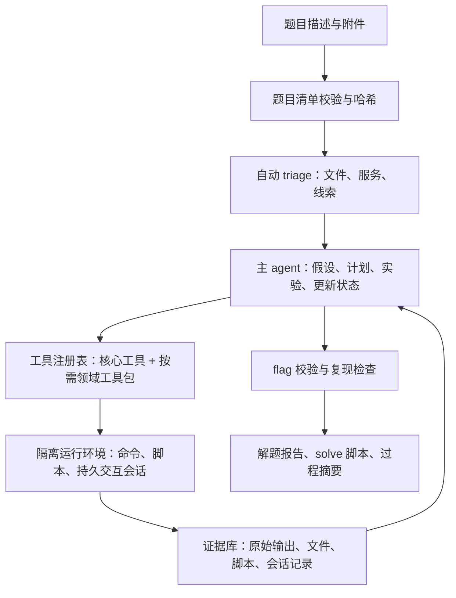

# ctfbot：AI + CTF 项目调研与设计计划

调研日期：2026-09-29  
文档状态：方案草案，供后续实现和验证使用

阶段 A–D 的详细目标架构、数据契约、工作包、交付物和验收标准见[详细设计与实施计划](AI_CTF_AGENT_DETAILED_PLAN.md)。

首版交付形态调整为键盘优先的 TUI，作为题目导入、解题监看、证据查看和交互会话的主要入口；doctor、报告导出和批量评测保留 headless 命令，复用同一 application service。首版不扩展 Web UI。

## 结论摘要

ctfbot 的方向有价值，但“按领域做一套工具集，再用多个 agent 分工”还不是必须的起点。建议先做一个可评测、可复现、受控的单 agent 解题闭环：统一题目输入与状态记录；让模型通过少量清晰的 CTF 专用接口调用普通命令、交互式程序和临时脚本；工具按需加载；所有观察、推断、动作和产物都落盘；用隔离环境和确定性 flag 校验保证解题结果可信。

对几个关键问题的直接回答：

1. **需要重新设计模型使用的工具接口，但不需要重写全部 CTF 工具。** 重点是为交互式会话、脚本执行、长输出、文件证据和错误反馈建立一致的模型友好接口；常用命令做薄封装，保留受限 shell 作为组合与兜底能力。
2. **暂时不需要单独的“临时脚本 agent”。** 写脚本、运行脚本、根据报错修改脚本，属于同一解题循环。独立脚本 agent 会增加调用成本和状态同步难度；只有日志证明独立并行的编码工作能提升效果后，再试做脚本 worker。
3. **领域专用能力值得有，领域专用 agent 不必一开始就有。** 先用可懒加载的工具包、流程手册和知识条目，保持一个主 agent 维护全局上下文。题型应允许多标签、随证据更新，避免把混合题强行锁进单一分类。
4. **可以基于现有项目降低起步成本。** EnIGMA 与 CTF 解题最贴近，适合作为可运行基线和接口设计参考；但其官方文档注明 CTF 模式目前只兼容 SWE-agent v0.7.0，存在版本与维护成本。建议做小规模适配验证后再决定 fork；若旧版阻碍模型接入或运行环境适配，就保留 ACI/IAT 思路，自建轻量 CTF runner。

## 1. 调研范围与本仓库现状

本次检查时，仓库中只有 `.agents/`、`.codex/` 和 `.git/`，没有 README、实现代码或现有设计文档。因此，对“当前架构”的评估依据是本次需求描述，而不是已有代码审查。下面的方案重点补齐需求描述尚未明确的运行环境、解题状态、验证方式、安全边界和评测设计。

调研以可访问的 GitHub 项目、项目文档和论文为主。项目在 README 中报告的结果受模型、预算、任务集、Docker 环境、执行次数和是否提供提示等条件影响，**不同项目的百分比不可直接横向排名**。本报告把结果作为设计线索，不当作复现结论。

## 2. GitHub 项目与相关基准

### 2.1 有代表性的 agent 设计

| 项目 | 设计与已报告结果 | 值得借鉴 | 局限与适用性 |
|---|---|---|---|
| [SWE-agent / EnIGMA](https://github.com/SWE-agent/SWE-agent)；[EnIGMA 论文](https://arxiv.org/abs/2409.16165) | 将 SWE-agent 的 Agent-Computer Interface 扩展到 CTF；加入交互式 agent tools（IAT），支持调试器、网络连接等需要持续交互的程序，并用 summarizer 控制长输出。官方文档报告其在 NYU CTF Bench 200 题上解出 13.5%，并明确说明 CTF 模式目前只支持 SWE-agent v0.7.0。 | 用模型易操作的命令和反馈格式，而不是只把原始 shell 原样暴露；为 GDB、nc 等 REPL 工具维护独立会话；处理超长工具输出；按领域准备演示或流程。 | 与特定旧版框架绑定。其成绩说明任务难度仍高，不代表工具接口本身即可解决所有题型。适合作为 PoC/基线，不应未经适配评估就成为长期基础架构。 |
| [NYU `nyuctf_agents` / D-CIPHER](https://github.com/NYU-LLM-CTF/nyuctf_agents)；[D-CIPHER 论文](https://arxiv.org/abs/2502.10931) | Docker 环境中运行 planner、executor，可选 auto-prompter；仓库同时提供单 executor 运行方式。论文报告其特定实验在 NYU CTF Bench、Cybench、HackTheBox 分别达到 22.0%、22.5%、44.0%。 | 规划和执行职责分离；可选前置侦察；更重要的是提供单 agent 与多 agent 的对照入口，便于验证复杂架构是否真有收益。 | 多角色会增加模型调用、上下文复制、协调和失败定位成本。论文的多 agent 结果不证明每个项目都应使用多 agent。NYU benchmark 与其 Docker 运行方式也会带来环境维护成本。 |
| [Amazon Science Cyber-Zero / EnIGMA+](https://github.com/amazon-science/cyber-zero) | 从公开 writeup 合成解题轨迹，不要求每条轨迹都运行真实 CTF 环境；提供适配 EnIGMA+ 的基准修复版本。项目报告训练后多个基准最高提升 13.1 个百分点。 | 关注实验规模、轨迹质量、基准环境修复和运行吞吐；当基础解题框架稳定后，可研究怎样把经验证的过程转化为训练或回归数据。 | 重点是轨迹生成、训练和批量评估，不是 ctfbot 首版所需的在线解题 runtime。公开 writeup 有答案泄漏风险，不能不加区分地用于盲测 agent 的检索库。 |
| [非独立后端的 CTF-Agent 工作流](https://github.com/nonoleekr/CTF-Agent) | 直接使用 Claude Code 的文件、shell、web 等能力，通过类别 playbook、文件 triage 脚本、workspace 和证据笔记完成解题；特殊能力才接 MCP。项目 README 记载其从早期硬编码分类和工具包装的 Python pipeline 转向使用通用 coding agent。 | 先看目标 agent 是否已有文件、shell、编辑、浏览器等能力；对模型原生能力没有必要重复造 MCP。把分类、操作手册和题目状态分开；题目目录及证据产物比聊天上下文可靠。 | 依赖具体宿主 agent 的能力、权限模型和计费方式；跨模型能力与统一 benchmark runner 未必容易保证。单一仓库的自述不能证明对所有题型都有效。 |
| [CTF Cyber Agent](https://github.com/allen-haitao/ctf-agent) | 提出 observe → hypothesize → plan → execute → collect evidence 的循环；用结构化事实、假设、实验、能力、失败记录和 append-only evidence 保存状态；限制网络目标范围。README 明确说明并非通用 CTF 自主解题器，部分领域仍是计划中的能力。 | 将事实和推断分开；记录失败实验，避免盲目重复；把报告和复现材料从对话里独立保存；把目标授权/范围和网络调用纳入系统状态。 | 这是规模较小的项目，适合参考状态模型，不宜单凭其架构说明推断解题效果或成熟度。 |

另有 [CTFAgent 论文](https://arxiv.org/abs/2506.17644) 研究两阶段 RAG 与交互式环境增强，并报告在 InterCode-CTF 上从其 baseline 的 39/100 提升到 73/100。论文说明该实现获取有访问审查，不是当前可直接 fork 的通用 GitHub 基础。可借鉴其“环境反馈与技术知识结合”的研究结论，但 RAG 内容和论文成绩必须与公开答案污染风险一起评估。

### 2.2 基准与数据集

| 基准 | 覆盖与用途 | 对 ctfbot 的建议 |
|---|---|---|
| [NYU CTF Bench](https://github.com/NYU-LLM-CTF/NYU_CTF_Bench) | 200 道 CSAW CTF 题，覆盖 web、pwn、forensics、reverse、crypto、misc；另有 55 题 development split，挑战以 Docker 环境组织。 | 可作为主要端到端评测候选。开发阶段使用 development split；实现冻结后再跑 test split，并按类别报告。其题目和解法均公开，必须把训练数据污染风险记入结果。 |
| [Cybench](https://cybench.github.io/) | 40 道来自 4 场赛事的专业级题目，难度跨度较大，并带有中间子任务。 | 作为较难任务和部分进度评估；不能用小题数上的单次结果代表整体能力。 |
| [InterCode](https://github.com/princeton-nlp/intercode) | 交互式 coding environment，包含 100 道 picoCTF 任务，强调 action-observation 和执行反馈。 | 适合快速验证基础交互闭环，但题目公开且任务范围有限，不宜作为唯一成功指标。 |
| [CTFTiny](https://github.com/NYU-LLM-CTF/CTFTiny) | NYU 发布的 50 题轻量 benchmark，相关论文同时研究参数调优和 CTFJudge。 | 适合做快速迭代集；应保持一份不参与提示、RAG 和开发调优的私有或改编集。 |

EnIGMA 论文还报告了公开 CTF 任务可能出现“模型直接复述训练中见过的挑战文件”的现象。这意味着“输出了符合格式的 flag”是必要但不总是充分的证据。需要保留实际执行轨迹，测试容器内运行和 flag 校验，并用未公开或经改编的题目检查泛化。

## 3. 对当前设计思路的评估

### 3.1 方向正确之处

- **把模型视为工具使用者来设计接口是合理的。** 通用 shell、几十个不一致命令、状态型程序和大量原始输出会令模型多花 token 在工具语法与输出整理上。EnIGMA 的 ACI/IAT 设计正是针对这些交互成本。
- **分领域组织知识与能力是合理的。** Web、pwn、密码学、隐写和取证需要的常用流程差别大；把专家习惯沉淀为可复用的操作手册、命令说明和确定性工具，可以提高覆盖和稳定性。
- **允许模型在运行时写临时脚本符合 CTF 实际。** 很多题的解法并不是调用一个现成命令，而是根据新发现编写小型解码器、exploit、解密或数据转换程序。

### 3.2 需要补上的设计问题

1. **题型分类不是一次性路由。** CTF 描述和文件名可能误导；题目可能混合文件取证、密码学、逆向和网络服务。分类应输出置信度和证据，支持多标签，并允许后续观察改变路线。低置信度时先运行低成本 triage。
2. **没有明确的环境与输入协议。** 需要定义题目包如何表达描述、附件、Docker 服务、连接地址、启动/停止命令、flag 格式、允许访问的目标、工具依赖和超时。否则每个 benchmark 或赛事都要写一次定制逻辑。
3. **工具返回必须保留原始证据。** 只给模型一段“总结”会丢失字节偏移、HTTP 响应、寄存器状态或报错细节；把完整日志直接塞上下文又会迅速耗尽窗口。两者应兼顾：短摘要 + 精确字段 + 原始输出/产物路径与 hash。
4. **CTF 重视状态和交互。** GDB、nc、服务端、调试器、Sage/Python REPL 可能需要跨多轮保留状态。短命的一次性命令封装不够；需要有 session id、读写超时、重连和显式关闭。
5. **缺少解题质量定义。** 至少区分 flag 找到、flag 可验证、过程可复现、报告与脚本完整、人工介入次数。仅看总体 solve rate 会掩盖某类别退化和模型成本过高。
6. **知识检索容易泄漏答案。** 流程知识（如何识别 RSA 小指数、如何检查 ELF）和题目答案/writeup 必须分库存放。盲测模式禁用答案库与相似题完整 writeup 检索；为检索内容记录来源和版本。
7. **工具安全边界还没有定义。** 执行 exploit 或脚本时应默认在每题隔离容器内；远端连接必须绑定明确授权的目标和端口，限制出网，避免容器访问宿主机凭据、Docker socket 和非题目资产。
8. **没有说明 agent 产品模式。** 建议明确至少区分自动解题、渐进式提示/辅导、人工确认的联网实验三种模式；相同工具和证据底层可复用，但预算与停止条件不同。

## 4. 建议的目标架构

### 4.1 解题状态与循环

每道题建立独立 `case` 目录和结构化状态，建议最少包含：

- `challenge.json`：题目 id、描述、附件清单及 hash、类别标签、环境启动方式、允许的远端主机/端口、flag 规则、预算与超时。
- `state.json`：当前目标、已确认事实、待验证假设、当前计划、会话索引、求解状态。
- `evidence.jsonl`：只追加的操作记录，包括时间、调用工具、参数、命令、exit code、摘要、原始输出路径和 hash。
- `artifacts/`、`scripts/`、`sessions/`、`report.md`：抽取产物、临时/最终脚本、会话日志和报告。

主循环按“观察 → 形成可证伪假设 → 选择能区分假设的实验 → 执行 → 记录证据 → 更新路线”推进。模型的观察和推断分开保存；失败尝试也记录理由和结果。完成条件不只看模型说“找到 flag”，还要通过规定的 flag verifier，并保存可以重跑的命令或脚本。

### 4.2 工具接口：薄层包装，保留组合能力

按稳定性和复用率逐步建设，不以工具数量为目标。

| 工具类别 | 初期接口 | 设计要点 |
|---|---|---|
| 核心文件与命令 | `list_files`、`read_file`、`inspect_file`、受限 `run_command` | 提供题目目录相对路径；限制工作目录、运行时间和输出大小；文件查看支持偏移、编码和 hexdump；shell 作为组合能力和兜底。 |
| triage 与领域操作 | 文件类型/metadata、strings、binwalk、pcap 摘要、ELF/PE 元信息、HTTP 请求等薄封装 | 仅封装常用且参数易错的工作流。底层命令和原始输出仍可追溯；工具包按题型信号动态加载，避免一开始给模型数十个工具定义。 |
| 临时脚本 | `write_script`、`run_script` 或同等受控文件编辑/命令能力 | 输入、代码、命令、stdout/stderr、exit code、生成文件、资源限制都要落盘。脚本运行与解题主 agent 共享 workspace 和证据状态。 |
| 交互式程序 | `start_session`、`send_input`、`read_output`、`stop_session` | 为 GDB/nc/REPL 提供持久会话 id，支持超时、短输出读取、会话恢复和清理；交互内容进证据日志。 |
| Web 与远端挑战服务 | 范围受限的 HTTP/browser/netcat 访问 | 在工具层检查 host/port allowlist；对每个 case 单独开启；默认本地题离线运行，不能因模型要求就放开任意出网。 |
| 结果验证与导出 | `verify_flag`、`export_report` | 依据 benchmark 或赛事给出的格式/校验接口验证；记录验证证据。不要把通用正则命中当作“已解出”的唯一依据。 |

统一工具结果建议包含 `summary`、`facts`、`artifacts`、`exit_code`、`stdout_excerpt`、`stderr_excerpt`、`session_id`、`error`。原始大输出写到文件，并给出行号/偏移、hash 和可继续读取的引用。这样模型可以先基于摘要决策，在需要时再查原文。

### 4.3 领域工具包与记忆

- 先提供通用 triage 和文件/命令能力，再根据题目描述、附件元信息与运行反馈加载 web、crypto、forensics、pwn、reverse 等工具包。工具包可以同时加载多个，分类不作为权限边界。
- 领域资料以流程和工具用法为主：输入线索 → 常见假设 → 推荐实验 → 成功/失败信号。RAG 结果必须显示来源。
- 记忆优先保存已验证的通用操作、工具环境差异和失败模式；按工具/题型/挑战环境版本标注。不要无条件把历史 flag、writeup、exploit 当作新题提示。
- 实验记录比长篇自由文本笔记更容易复用：记录“假设、动作、输出、结论、是否排除”，并避免在新题中重放与当前证据无关的所有历史。

## 5. 是否需要专门的临时脚本 agent

**MVP 不建。** 临时脚本多数是为了验证主 agent 提出的假设，例如解码文件、枚举有限参数、实现一次 oracle 查询或封装 exploit。脚本生成后的运行结果必须立即回到同一解题状态，若拆成另一个 LLM agent，主 agent 还要重新解释题目、同步文件与结论，容易产生重复调用和隐性信息丢失。

建议先提供安全的脚本写入/执行能力，并设置 CPU、内存、时限、文件和网络权限。只有以下场景才值得评估独立 worker：存在多条互相独立且适合并行的算法路线；主 agent 因代码细节反复迭代而耗尽预算；或者实测脚本 worker 在固定预算下提高正确率/降低成本。worker 的契约要明确输入证据、输出脚本及运行结果，写入同一 case 目录，不能独立扩大网络范围。

## 6. 是否要按领域建立专用 agent

先把“领域专家”实现为**工具包 + playbook + 可选的短上下文咨询**，不预设每个领域需要一个常驻 agent。一个全局 orchestrator 能共享跨领域线索、会话和假设；若多个 agent 各自拿到不完整题目状态，可能对同一个目标重复扫描，或漏掉跨类别链路。

后续若比较发现多 agent 有净收益，再按角色划分为“独立假设/分析任务”，而不是机械地一类工具对应一个 agent。至少要有单 agent 对照组，固定模型、token/时间预算和执行环境，比较解题率、成本和重复动作率。

## 7. 从现有项目起步的性价比建议

建议分两步决策：

1. **把 EnIGMA 作为首个可运行基线候选。** 它已经覆盖 CTF 所需的交互式工具、长输出处理和类别演示，距离目标最近。先固定 SWE-agent v0.7.0，验证模型 provider、工具扩展、NYU development 题启动和结果记录；同时记录依赖、运行镜像与需要修改的代码面。
2. **用小型 benchmark spike 决定 fork 还是自建薄 runner。** 若升级模型、加入统一状态/证据 schema、题目导入和安全策略不需要大范围改 SWE-agent 内部结构，可先 fork 作为基线。若版本锁定或框架抽象妨碍这些需求，就实现小型 CTF orchestrator，复用其 ACI/IAT 设计，并通过 adapter 调用容器内工具。D-CIPHER 作为多 agent 对照样本，不作为默认首选；NYU benchmark 和 EnIGMA/Cybench/InterCode 提供数据与复现实验参考。

这样既能回答“重造轮子有没有必要”，也避免在没有数据的情况下先承担维护完整研究框架的成本。

## 8. 建议实现阶段与评测门槛

### 阶段 A：环境与基线

- 明确首版支持本地附件题、Docker 服务题还是远端挑战；建议先覆盖本地附件和可复现的本地服务题。
- 选定题目 manifest、case 目录、证据 schema、flag verifier 和容器边界。
- 跑通 EnIGMA 候选或最小 runner，在小型开发集完成一轮端到端尝试；先记录基线，不追求首版覆盖所有 CTF 类别。

### 阶段 B：单 agent 解题闭环

- 通过 TUI 完成并呈现 triage、假设/实验循环、脚本执行、持久交互会话、运行事件监看、证据查看、输出裁剪与原始证据引用。
- 给出可配置时间、token、命令次数和容器资源预算；每道题完成后导出报告和复现材料。
- 先用 NYU development 或 CTFTiny 做迭代，不用同一组 test 题反复调 prompt。

### 阶段 C：用消融实验决定复杂度

在相同模型、任务、预算和容器下比较：

- 受限 shell 与常用工具薄封装；
- 无持久会话与 IAT/session；
- 单 agent 与 planner/executor 或领域 subagent；
- 仅程序性知识与启用检索；
- 直接展示完整输出与摘要 + 证据引用。

记录按领域 exact-flag solve rate、重复实验率、每题 token/费用/耗时、人工介入次数、轨迹复现率和误报率。论文成绩不能代替本地同条件对照。

### 阶段 D：扩大覆盖并沉淀记忆

- 扩充隐写、取证、流量、pwn、reverse、web、crypto 等领域包；加入混合题与未知题型评估。
- 建立私有或变体题目集；公开基准用于可比性，隐藏集用于验证泛化。
- 在经过验证后，再探索高质量轨迹生成、检索增强和选择性并行 agent。

### 建议的发布验收指标

- 按类别报告验证通过的题数和成功率，不只报总体平均。
- 所有“已解”结果都能对应校验记录；随机选取的成功轨迹可在冻结环境中复现。
- 记录每题成本、总时长、失败原因和人工介入，不以单一 success rate 作为优化目标。
- 盲测期间答案检索关闭或严格隔离；报告题目来源、是否公开、是否用于 prompt/RAG/开发。
- 沙箱越界、未授权目标连接和 flag 误判作为阻断级问题，目标为零。

## 9. 创新点、困难点与主要风险

### 可形成的项目差异

1. **可追溯的 CTF 工具接口。** 每个调用有短反馈、机器可读字段、原始输出、文件 hash 和复现命令；模型能高效读取证据，人也能审查轨迹。
2. **围绕假设测试组织状态。** 不只保存聊天记录，而是管理事实、候选路线、实验和淘汰理由，让失败尝试也能减少搜索空间。
3. **按需提供专业能力。** 通用循环保持简单，工具包/流程逐步扩展；混合题允许多领域交叉和动态切换。
4. **把脚本当成一等解题产物。** 代码、输入、环境版本、输出和验证结果可一起导出，方便复现、教学和未来回归测试。
5. **用消融实验决定架构复杂度。** 单 agent、多 agent、RAG、工具封装、session 各自有成本和效果数据，不因“看起来更 agentic”而盲目加层。

### 主要困难

- 题目环境与工具链繁杂，Docker 镜像可能损坏、端口不一致、架构不同或依赖缺失；agent 的错误也可能其实是环境故障。
- 交互式调试和网络会话有状态，输出量大，超时与清理逻辑容易造成“看起来成功、实际状态错位”。
- 模型会过早固化错误分类、重复执行无效步骤或忽略关键字节级证据；需要合适的状态和证据结构，而不是只加更长 prompt。
- 各领域难度和评测可靠性差异很大；公开 CTF 训练污染与过拟合会使 benchmark 数字虚高。
- 强工具能力必须被目标范围和运行隔离约束；网络访问和生成的 exploit/script 都要可审计。
- 端到端成功率受模型能力、模型调用预算、工具镜像、挑战配置、任务公开程度共同影响，单次运行结果波动大。

## 10. 参考链接

- [SWE-agent EnIGMA 文档与版本兼容说明](https://github.com/SWE-agent/SWE-agent/blob/main/docs/background/index.md)
- [EnIGMA: Enhanced Interactive Generative Model Agent for CTF Challenges](https://arxiv.org/abs/2409.16165)
- [NYU CTF Automation Framework：D-CIPHER 与 baseline](https://github.com/NYU-LLM-CTF/nyuctf_agents)
- [D-CIPHER 论文](https://arxiv.org/abs/2502.10931)
- [NYU CTF Bench 仓库](https://github.com/NYU-LLM-CTF/NYU_CTF_Bench)；[数据集与 split 说明](https://nyu-llm-ctf.github.io/docs/installation/dataset/)
- [Cyber-Zero / EnIGMA+](https://github.com/amazon-science/cyber-zero)
- [CTFAgent 论文](https://arxiv.org/abs/2506.17644)
- [Cybench](https://cybench.github.io/)
- [InterCode](https://github.com/princeton-nlp/intercode)
- [CTFTiny](https://github.com/NYU-LLM-CTF/CTFTiny)
- [以 Claude Code 原生能力为主的 CTF workflow 示例](https://github.com/nonoleekr/CTF-Agent)
- [证据驱动解题循环参考](https://github.com/allen-haitao/ctf-agent)
