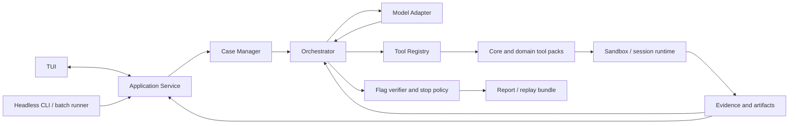

# ctfbot 详细设计与实施计划

日期：2026-09-30

基线状态：阶段 A 最小闭环已完成：薄 runner、结构化工具循环、私有 evidence、oracle verifier、Docker adapter 和批量 runner 已实现；fake/synthetic 检查、adapter synthetic live smoke、一次真实解题 smoke 和 input-only 离线边界测试已通过。EnIGMA v0.7.0 仅作源码静态参考，不要求安装或运行。10 道 pilot 已正式准入为私有本地数据并生成快照；cry-babycrypto smoke 由 exact verifier 接受，1 turn / 6 tool calls，provider usage 未返回。provenance 曾被模型读取；当前工具/runtime 只暴露 `input/` 的约束已通过离线 synthetic 单测。Docker 更广负面隔离验收、provider usage/error/cancel 语义和批量 CTF baseline 属于后续扩展验收，不阻塞进入下一阶段。ChatGPT/Codex 是 provider-neutral adapter 后面的临时 provider。详见[阶段 A 施工记录](phase-a/README.md)。
上位方案：[AI CTF Agent 设计计划](AI_CTF_AGENT_DESIGN_PLAN.md)
竞品输入：[AI + CTF 竞品调研报告](CTF_AI_COMPETITOR_RESEARCH.md)
当前工程基线：[项目基线记录](PROJECT_BASELINE.md)
阶段 A 施工记录：[环境与基线记录](phase-a/README.md)

## 1. 计划目的

本文件把上位设计中的阶段 A–D 展开为可拆分、可验收的迭代路线。阶段 A 的 headless 最小闭环已经通过；下一步先交付一条范围有限但可实际使用的 TUI 单题路径，再逐轮扩大运行模式、领域覆盖、评测和记忆。阶段 A 的扩展验收按后续能力的风险和依赖排期，不作为统一启动门槛。各轮都保留授权、隔离、预算、验证和证据记录的硬性底线。

总体路线：

> 以阶段 A 的可复现 headless 闭环为基线，先完成窄范围的 TUI 产品闭环；之后按小步扩展运行能力和领域覆盖，并让评测贯穿每轮，直到达到完整产品目标。先完成每轮范围内的闭环，再按风险和证据完善。

## 2. 产品目标与交付边界

### 2.1 最终产品目标

- 使用者提供题目描述、附件、flag 格式和可选挑战服务；ctfbot 在每题隔离的工作目录/运行环境中分析题目。
- 一个主 agent 按证据选择工具、写入并运行临时脚本、迭代假设，能与 GDB、nc、REPL 等交互程序保持会话。
- 所有输入、工具调用、失败尝试、输出、提取文件和脚本都有可复查记录。
- 能区分“格式看起来像 flag”“候选 flag”与“通过外部/本地校验的 flag”。
- 每次运行受时间、模型调用、工具调用、CPU、内存、文件容量及网络范围限制。
- 提供可导出的运行报告，包含复现命令和实际证据引用。

最终运行模式覆盖获准的本地附件题、本地服务题和显式 allowlist 远端题。以上目标逐步达成，不要求在同一个里程碑内全部完成。

### 2.2 第一条产品闭环

阶段 B 先支持获准的本地附件题：在 TUI 导入并预览附件，启动和观察单 agent 运行，使用首批 core tools，提交候选并由 controller verifier 判定，查看 evidence 并导出基础报告。先只支持已完成相应隔离和预算检查的运行配置；不支持的模式必须明确拒绝。真实题目数据只在取得该题目的模型传输授权后发送。

第一条产品闭环完成后，按阶段 C 扩展 session、服务型题目和其他运行模式，再按阶段 D 扩大领域和评测范围。当前阶段 A 已有的 `baseline-smoke` 与单题 smoke 是工程基线，不取代 TUI 产品闭环。

### 2.3 项目范围外

- 不做 CTFd、HTB 等平台账户接入，不自动登录或提交线上比赛答案。
- 不做多人协同 Web 控制台、Discord bot、云端 worker fleet。若以后要做团队工作台，单独立项评估 NUSGreyhats 类方案。
- 不默认载入公开 writeup、已知 flag、历年题解或解题脚本作为 RAG 语料。
- 不默认创建领域专职 agent 或独立临时脚本 agent。
- 不允许模型直接访问宿主机 shell、Docker socket、宿主机凭据或任意公网目标。
- 不把能启动工具容器视为题目已解决；验证等级必须写入结果。

### 2.4 设计默认值

| 项目 | 默认决定 | 决策依据/后续检查 |
|---|---|---|
| 交付形态 | TUI 是主要交互入口；headless 命令用于诊断、报告、评测和自动化 | 阶段 B 先实现完成本地附件单题闭环所需的最小 TUI，再逐轮补足会话和工作区功能。底层用同一 application service 支持批处理，不扩展 Web UI。 |
| 实现语言 | Python 3.11+，已写入项目元数据 | CTF 现成库、exploit、crypto 和 forensics 脚本生态集中；`pyproject.toml` 声明最低版本为 3.11。 |
| Agent 架构 | 单主 agent + 工具包动态启用 | 保持跨领域上下文共享；多 agent 需要消融收益才能加入。 |
| 执行模型 | Controller 与每题 sandbox 分离 | Controller 保持凭据和编排；sandbox 执行题目文件、shell 和生成脚本。 |
| 首批题源 | 已准入的 CTFTiny 本地 pilot、NYU development 子集和自有/改编授权题 | 每次实际传输都按题目授权；公开题用于开发评测，隐藏或改编题用于估计泛化。题目文件和镜像许可逐项确认。 |
| 运行时底座 | 阶段 A 已决定使用 ctfbot 自有薄 runner；Docker CLI adapter 仍是待完整验收的候选 backend | EnIGMA v0.7.0 仅作静态参考，不要求运行或 fork；ADR-002 尚未冻结默认 backend，更广 sandbox 负面验证在扩展相应运行模式前完成。 |
| 数据保存 | 每次 run 一个独立目录；JSON/JSONL + 原始产物文件 | 首版不需要独立数据库；为回归和报告保留稳定格式。 |
| LLM 支持 | 阶段 B 复用 provider-neutral `ModelSession` 和现有临时 Codex adapter；其他 provider 后续按需接入 | 避免同时调试多个 API。Codex experimental API 的兼容、usage、错误和取消语义在依赖它们的长任务或评测能力前单独验证。 |

## 3. 目标架构与模块职责



### 3.1 模块拆分

| 模块 | 责任 | 明确不做的事 |
|---|---|---|
| `tui` | 提供题目导入、运行监看、证据查看、会话交互和报告浏览；通过 application service 读写运行状态并订阅事件。 | 不直接运行命令、不绕过编排/权限检查、不将不可信输出作为终端控制序列发送。 |
| `application` | 提供创建/恢复 run、查询状态、发送控制动作、读取证据和导出报告等用例接口；协调 case manager、orchestrator、runtime 和 evidence。 | 不依赖具体 TUI 框架或 provider SDK；不重复实现业务策略。 |
| `cli` | 提供 TUI 启动器及 doctor、report、bench 等非交互命令；自动化需要时可调用相同 application service。 | 不维护与 TUI 不同的解题状态机或安全策略。 |
| `challenge` / Case Manager | 解析并校验题目清单；复制输入附件；记录 hash；创建 run 目录；校验环境和预算配置。 | 不推断题目答案、不把附件当作可信配置、不直接执行任意附件脚本。 |
| `orchestrator` | 管理 run 状态；构造有限上下文；调用模型；验证并分发工具调用；控制预算、重试、停止和汇总。 | 不自行执行宿主机命令；不把模型声称成功等同于 verified。 |
| `model_adapter` | 将 ctfbot 内部请求映射到某 provider 的消息/工具 schema；归一化文本、tool call、usage、错误和重试信息。 | 不保存 provider key 到题目目录；不执行工具；不隐式改写题目事实。 |
| `tool_registry` | 注册工具定义、输入 schema、能力标签、风险等级、超时和运行约束；按类别/信号加载工具包。 | 不允许工具定义绕过 sandbox policy；分类只用于发现工具，不作为安全授权。 |
| `runtime` | 创建/回收 challenge container；执行命令和脚本；管理持久交互 session；保存进程日志。 | sandbox 内不挂载 Docker socket、provider 凭据或宿主机敏感路径。 |
| `evidence_store` | 保存原始工具输入/输出、结构化事实、实验状态和 artifacts；生成 hash 与引用。 | 不只保存模型摘要；不将模型解释存为未经标记的事实。 |
| `verifier` | 处理 benchmark gold oracle、平台回执、challenge 自带 validator、格式检查和人工确认等级。 | 无 oracle 时不把正则匹配升级为 verified。 |
| `reporter` | 从 run 记录生成 Markdown 报告、复现步骤、工具清单和 solved status。 | 不创造未出现在日志中的命令、结论或证据。 |
| `bench` | 批次运行、结果汇总、固定预算、seed、模型和镜像元数据管理。 | 不在盲测结果出来后用相同 test set 反复调 prompt。 |

建议的 Python 源码边界（模块名可调整，依赖方向保持一致）：

```text
src/ctfbot/
  application/         # solve/resume/report 用例编排
  tui/                 # 交互式终端界面与安全渲染
  cli/                 # TUI 启动器及 headless 命令
  challenge/           # manifest、附件导入、case/run 状态
  agent/               # orchestrator、prompt/context 构造、stop policy
  model_adapters/      # provider API 归一化
  tools/               # registry、core tools、domain packs
  runtime/             # container/session backend 与 policy enforcement
  evidence/            # event log、facts/hypotheses、artifact refs
  verification/        # oracle、challenge validator、verification levels
  reporting/           # report、replay bundle
  benchmark/           # dataset adapter、batch runner、metrics
```

依赖方向建议为 `tui/cli → application → domain modules`; `agent` 通过 `model_adapters` 和 `tools` 的接口工作；`tools` 只能通过 `runtime` 请求执行；`evidence` 是独立接口，不依赖 provider SDK。TUI 与 headless 命令复用同一 application service 和状态机。

### 3.2 运行边界

Controller 管理 LLM provider 凭据和 case 元信息；每题的 challenge sandbox 只接收该题所需文件、工具镜像和显式允许的目标服务。远端 API 调用从 controller 发起。题目文件与生成脚本在隔离工作区执行。

首版默认安全配置：

- 本地附件题不具备公网出网；题目服务使用单独的 per-case network。
- 远端题只有配置允许 host、port、protocol 后才可连接；工具执行时再做范围校验。DNS 解析到的 IP 和重定向后的目标也要复核，防止 scope 绕过。
- 出网范围必须由 sandbox/runtime 层强制执行（例如 per-case network namespace、受控代理或等效防火墙策略），不能只靠 `http.request` 工具校验；否则模型仍可经 `shell.run` 使用 curl/nc 绕过。默认无 egress，允许远端题时只开放 manifest 中的目标及必需协议。
- sandbox 不挂载宿主机 home、SSH/API key、Docker socket 或运行配置；使用非 root 用户和只读 challenge input。
- 普通容器隔离不能自动视作高保证的安全边界。若威胁模型包括恶意二进制、攻击性服务镜像或需要广泛利用的题目，优先使用 rootless 容器或每题 disposable VM；未经过安全评审前，不对宿主机隔离强度作保证。
- 限制 CPU、内存、进程数、磁盘、单命令时长、总 run 时长、并行 session 数和单次输出大小。
- 题目描述、附件和网络响应均视为不可信数据；不能将其中的提示注入当作 system policy。所有工具调用照样过 schema 和 policy 检查。
- API key 从进程环境/秘密存储注入 model adapter；日志和报告中做 secret redaction。
- 若运行时只能通过共享宿主 Docker daemon 启动容器，不向 sandbox 暴露 daemon socket；Controller 对镜像、mount、capability 和 network 配置使用 allowlist。

### 3.3 题目 manifest

推荐 YAML 输入格式；读取后转换并校验为版本化内部 JSON schema。以下字段是设计基线，实际 schema 应加 JSON Schema 文档及错误定位：

```yaml
schema_version: 1
id: example-crypto-01
name: Example Challenge
categories: [crypto, misc]
description: statement.md
attachments:
  - path: files/output.txt
    sha256: auto
flag:
  format: 'flag\{[ -~]+\}'
  verifier:
    kind: format_only  # benchmark_oracle | command | platform_receipt | format_only | manual
environment:
  kind: local          # local | compose | remote
  compose_file: null
  targets: []
policy:
  network: disabled    # disabled | challenge_services | allowlist
  allowlist: []
budget:
  max_turns: null
  max_tool_calls: null
  max_wall_seconds: null
  max_output_chars: null
```

规则：

- 路径必须在 case 输入目录内，拒绝绝对路径、`..` 越界和被跟随后越界的 symlink。
- 附件 hash 由 ctfbot 计算并固定；`auto` 只代表导入时计算，不代表允许每次 run 改变。
- `categories` 为多标签；`unknown` 合法。模型可提交新的候选标签，但必须记录证据和置信度。
- `environment.kind=remote` 必须存在非空 allowlist 和授权确认值；禁止 prompt 自动添加 allowlist。
- `verifier.kind=format_only` 只能返回 `format_valid_candidate`，绝不返回 `verified`。
- Compose 配置需要经过 ctfbot policy 检查；首版拒绝 privileged、host network、Docker socket、宿主机敏感 mount 等不安全字段。
- 基准服务镜像锁定 digest；未知来源的 Compose/build 配置不直接在 Controller 上执行。无法保证环境配置可信时，在 disposable VM 运行。

### 3.4 Run 目录和持久化结构

```text
data/
  challenges/<challenge-id>/
    manifest.yaml
    input/                         # 导入时固定的只读附件
    runs/<run-id>/
      manifest.snapshot.json       # 当次运行使用的完整配置
      state.json                   # 当前状态快照
      events.jsonl                 # append-only 审计轨迹
      model/                       # 不保存密钥；可保存脱敏请求摘要与 usage
      work/                        # agent 可写目录
      scripts/                     # 生成/修改的脚本
      artifacts/                   # 提取文件、转换结果和可交付产物
      sessions/                    # 交互式 session transcript
      reports/
        report.md
```

规范：

- `input/` 原则上不可写；要转换输入时复制到 `work/` 并记录来源 hash。
- 每个 run 是独立隔离目录；resume 同一个 run，retry 创建新 run 并关联 `parent_run_id`。
- JSONL 事件只追加；`state.json` 是可重建的便捷快照，不能替代 event history。
- 原始 stdout/stderr 大文件单独写入 `artifacts/`，事件记录短 excerpt 和 hash。
- 时间使用 UTC ISO 8601；记录 ctfbot 版本、model id、prompt/tool schema 版本、镜像 digest、题目附件 hash 和 budget。

### 3.5 核心数据对象

`state.json` 至少包含：

- `run_status`: `created | preparing | ready | solving | candidate | verified | unsolved | environment_error | error | cancelled`。
- `facts`: `fact_id`、描述、`observation|inference`、来源 evidence refs、置信度、创建时间。
- `hypotheses`: 假设文本、支持/反驳证据、建议区分实验、状态 `untested|active|supported|rejected`。
- `experiments`: 输入假设、计划动作、工具调用 refs、观察结果、结论、是否重复/排除。
- `category_hypotheses`: 多标签、置信度、触发线索、最后更新的事件序号。
- `active_sessions`: session id、工具类型、创建事件、运行状态；真实 PTY/连接句柄由 runtime 管理。
- `flag_candidates`: 候选值可加密或脱敏存储、来源 evidence、校验等级、校验回执。
- `budget_usage`: model turns/tokens/cost、tool calls、wall time、资源峰值（如可获得）。

`events.jsonl` 的通用字段：

```json
{
  "schema_version": 1,
  "seq": 42,
  "timestamp": "2026-09-29T08:00:00Z",
  "event_type": "tool_result",
  "run_id": "...",
  "actor": "agent|orchestrator|runtime|verifier|user",
  "tool_name": "shell.run",
  "input_summary": {},
  "result_summary": {},
  "artifact_refs": [],
  "status": "ok|error|denied|timeout"
}
```

写日志前脱敏 provider secret、authorization header、cookies、challenge 端点凭据等；完整 challenge 附件不复制到事件字段中。

### 3.6 工具接口

工具注册定义至少包含：`name`、`description`、`input_schema`、`pack`、`capabilities`、`risk_level`、`requires_network_scope`、`default_timeout`、`max_output_bytes`、`runtime`。

统一返回对象：

```json
{
  "status": "ok|error|denied|timeout",
  "summary": "简短结论",
  "facts": [],
  "exit_code": 0,
  "duration_ms": 120,
  "stdout_excerpt": "...",
  "stderr_excerpt": "",
  "artifact_refs": [{"path": "artifacts/cmd-42.stdout", "sha256": "..."}],
  "session_id": null,
  "policy_decision": "allowed"
}
```

工具包安排：

| 工具包 | 初版能力 | 延后或可选能力 |
|---|---|---|
| `core` | list/read/stat/hash、文本/字节切片、文件类型、受限 shell、workspace 文件编辑、脚本运行 | unrestricted host shell、后台 daemon、任意下载。 |
| `crypto` | Python 脚本运行；常用编码/哈希/数论库；工具版本和资源限制 | SageMath 重镜像、GPU cracking、外部 FactorDB 查询默认不启用。 |
| `forensics-stego` | file/metadata/strings/archive、图片基本检查、pcap 摘要；工具输出文件化 | 磁盘镜像大规模恢复、在线样本上传。 |
| `reverse-pwn` | ELF/PE 元信息、strings、objdump、checksec；GDB session；pwntools 可用 | 商业反编译器按使用者许可外挂；自动 exploit 库大范围安装后再评估。 |
| `web` | 目标 allowlist 内的 HTTP request、响应对比、有限 browser session | 任意域名爬取、广域扫描、通用漏洞扫描器默认不启用。 |
| `network-misc` | pcap/tshark、基本协议解析、有限 socket session | 任意网段扫描和非挑战目标访问。 |

优先使用已有 CLI 工具并做好 schema/结果归一化；重复、高风险、参数易错或输出巨大时才写工具 wrapper。模型仍能通过 `shell.run` 在容器内组合命令。类别只控制发现/载入，不控制网络授权。

### 3.7 解题循环与结束状态

1. **Intake**：验证 manifest、路径和 hash，检查许可/授权字段，初始化 run。
2. **Prepare**：构造 runtime；启动 challenge service（若配置）；记录镜像/服务健康状态。环境未就绪时不能调用解题模型。
3. **Triage**：确定性检查文件类型、目录、服务、可用工具；得到类别候选和事实，不做昂贵扫描。
4. **Reason**：主 agent 阅读短摘要与相关 artifacts，维护最多若干活跃假设，并优先挑选能区分假设的高信息量实验。
5. **Act**：模型提出 tool call；orchestrator 验证 schema、预算、scope、路径和副作用，再交给 runtime 执行。
6. **Observe**：返回短摘要和 refs；原始日志/新产物落盘；facts/hypotheses/experiments 更新。
7. **Verify**：提取 flag 候选后调用对应 verifier；保存 `candidate / verified / rejected / unverified` 状态。
8. **Stop**：达到 verified、预算耗尽、用户取消、环境不可用或连续无进展阈值时停止；输出结论、未解决点和下一步建议。

无进展检测由确定性规则辅助：相同工具名与归一化参数重复调用且中间没有新增证据时，第一次提示避免重复，第二次要求模型改变假设或说明重试理由；达到配置的无进展窗口（建议初值为 3 次低信息量实验）后停止或要求人工指导。不得仅因输出文本相似就判定重复，避免阻止有意重复的 oracle 采样。

模型无需每轮重复输出全量计划；每轮至少携带当前目标、活跃假设、最新关键证据、工具可用性、剩余预算和下一步约束。超过上下文阈值时按结构摘要旧轨迹，但保留 event refs 和原始数据。

## 4. 阶段路线总览

| 阶段 | 闭环范围 | 主要交付物 | 通过条件 |
|---|---|---|---|
| A：已完成的 headless 基线 | 合成路径和一次获准的本地附件解题 smoke | 单 agent tool loop、evidence、verifier、Docker adapter、provider-neutral adapter、batch wiring 和阶段记录 | 最小闭环已通过；不代表完整 TUI、全部题型或完整隔离认证。 |
| B：第一条可用产品闭环 | 获准的本地附件题、单 agent、一个 provider 路径和 core tools | 最小 TUI 导入/预览、运行观察、候选验证、evidence 和基础报告 | 限定范围内可端到端运行；授权、隔离、预算和验证状态正确。 |
| C：逐种扩大运行能力 | 分增量交付运行生命周期、交互 session、本地服务和显式 allowlist 远端；这些都是最终目标，不因拆分迭代而省略 | 每种模式的一条完整路径、对应 adapter/runtime 检查、失败和清理状态 | 每个模式分别满足自身授权和安全边界；已有闭环持续可用。 |
| D：领域覆盖与最终闭环 | 六类基础工作流、受控泛化评测、经审核的通用记忆 | 领域覆盖矩阵、报告/复现、分层 benchmark 和来源清楚的记忆 | 所有原定产品目标均有验收记录；不以无依据的 solve-rate 数字代替验收。 |

阶段可以拆成独立迭代；每轮都先完成其定义范围内的闭环，再记录范围外的完善项和触发条件。安全、授权、预算、controller verifier 与 evidence 是跨阶段硬门槛。评测贯穿 B–D；RAG、多 agent、race 等高级复杂度须有同预算增益证据。阶段 A 扩展验收不再作为所有后续工作的统一 exit gate。

### 4.1 统一增量验收门槛

每个可独立交付的增量都在计划或实现记录中明确以下项目；阶段 B–D 的局部验收不能替代最终目标验收：

- **闭环范围**：本轮支持的输入、运行模式、题型、provider 和明确拒绝的路径。
- **进入条件**：上一条已交付闭环的回归路径通过；本轮题目、数据传输和模型/运行预算授权清楚。
- **完成条件**：代表性输入能从导入走到明确结束状态；工具结果有 evidence 引用；candidate/verified 状态准确；报告只呈现已记录动作；本轮启用模式通过相应的隔离、失败和清理检查。
- **阻断问题**：越权访问、未授权网络或数据传输、secret/oracle 泄漏或将 gold oracle 暴露给模型/sandbox、预算无法强制执行、未验证却标记 verified，任一项均阻断受影响能力。Oracle 只由 controller 侧 verifier 持有和执行。
- **后续完善项**：记录风险、触发条件、目标验收、复查节点及责任阶段；不得将范围外项目默认为当前增量的阻塞项。

## 5. 阶段 A：环境与基线

### 5.1 目标

记录已完成的 headless 工程基线、阶段 A 选型和一次性授权 smoke，作为阶段 B 的起点。阶段 A 已通过最小闭环；本节的状态不把 Docker 广泛负面验证、provider 完整语义或批量真实 baseline 写成已完成。

### 5.2 工作包

| ID | 状态与工作内容 | 输出/证据 | 后续安排 |
|---|---|---|---|
| A1 范围确认：完成 | 定义本地文件、本地 Compose 和远端 allowlist 的授权、拒绝边界。 | [范围与威胁边界](phase-a/scope.md) | 各模式启用前，按该模式要求验证授权和运行边界。 |
| A2 底座 spike：完成（静态参考范围） | 审查 EnIGMA v0.7.0 的 CTF ACI/IAT、session、摘要、领域配置、依赖和数据流；不要求修复其依赖或运行题目。 | [runner/runtime 评估](phase-a/runner-runtime-spike.md)、ADR-001 | 不阻塞后续；若未来有性能比较需求，另立实验。 |
| A3 sandbox：最小合成 smoke 通过，扩展验收未完成 | ctfbot Docker adapter 已在静态 BusyBox 合成镜像上验证命令执行、基本资源限制、只读 `/challenge` 输入挂载、断网、超时终止和清理；一次单题 smoke 使用固定本机镜像完成了只读输入/限额工作区路径。 | synthetic adapter smoke、[单题 smoke 报告](phase-a/solve-smoke-cry-babycrypto.md)和 [ADR-002](phase-a/decisions/ADR-002-runtime.md) | 当前 backend 仍是候选；扩大至其他挂载/镜像、服务、联网或更高风险输入前，完成对应异常/宿主边界负面验证；不把现有 smoke 称为 VM 级认证。 |
| A4 pilot：10 道私有本地题已准入 | 固定附件 hash 与 allowlist，快照位于仓库外；正式 manifest 的 `model_data_authorized=false`。 | [准入审查](phase-a/admission-review.md)、[pilot set](phase-a/pilot-set.md) | 每次向模型传输单独明确授权；扩大 benchmark 时追加授权与预算。 |
| A5 基线协议：工程预算已固定，provider usage 未返回 | runner 强制 turns、工具调用、墙钟、单命令及输出上限；候选与 verified 分离。 | [baseline protocol](phase-a/baseline-protocol.md) | 在依赖 usage/cost 计量、provider 重试或长任务控制前，补验 provider 对应语义。 |
| A6 执行：合成闭环及一次单题 smoke 通过；批量 baseline 未运行 | `baseline-smoke` 离线 synthetic 路径通过；一次经明确授权的 cry-babycrypto smoke 经 exact verifier 接受（1 turn、6 tool calls）。 | [单题 smoke 报告](phase-a/solve-smoke-cry-babycrypto.md) | 一次授权已消耗；批量真实 baseline 在阶段 B 可用后，按新题目与预算授权分批执行。 |
| A7 选型决策：完成 | 使用自有薄 runner，模型通过 provider-neutral `ModelSession` 接入；Codex App Server 为临时 adapter。 | ADR-001、ADR-002、ADR-003 | experimental dynamicTools 不宣称稳定；接入新 provider 时按契约单独验收。 |
| A8 TUI spike：完成 | Textual fake-event 原型验证 resize、焦点、长日志、无颜色和安全文本呈现。 | [TUI spike](phase-a/tui-spike.md)、ADR-008 | 正式 TUI 在阶段 B 从最小产品路径开始；spike 结果不是正式工作台验收。 |

### 5.3 阶段 A exit gate

**最小闭环已通过，阶段 A 对进入阶段 B 的 exit gate 关闭。** headless loop、evidence、工具 registry、controller verifier、预算控制和 Docker adapter 已落地；synthetic baseline 与 adapter smoke 通过；一次获准单题 smoke 经 exact verifier 接受；TUI 可行性 spike 和 runner/provider 选型已有记录。

这项结论不表示批量 baseline 已运行、provider usage 语义完整，也不表示 runtime 已完成恶意镜像或宿主隔离认证。上表列出的扩展检查按适用能力触发，不阻止开始阶段 B。

### 5.4 阶段 A 扩展工作的触发点

| 扩展工作 | 触发点 |
|---|---|
| Docker 异常路径、host mount、DNS/网络越界等负面验证 | 超出当前只读 `/challenge` + tmpfs `/work`、固定 smoke 镜像和断网 profile 前；新增服务或联网模式前也须验证对应路径。 |
| Provider usage、错误、timeout、cancel 和 experimental API 兼容性 | 依赖精确成本/usage、重试、长任务控制或批量调度之前。 |
| 批量真实 baseline 与复跑 | 第一条产品闭环可用后，获得明确题目传输授权及批次总预算时；每道题保留独立准入状态。 |

## 6. 阶段 B：第一条可用产品闭环

### 6.1 目标

先交付第一条范围有限但实际可用的产品闭环：通过 TUI 导入/预览获准的本地附件题，启动并观察单 agent 运行，提交候选交由 controller verifier 判定，查看 evidence 并导出基础报告。headless 与 TUI 共用同一 application service。

阶段 B 只启用已明确授权、预算受控且对应隔离边界已验证的本地附件运行配置。它不要求六类工具包、远端题、完整 session 管理、隐藏集 benchmark 或高级 TUI 一次到位；这些能力分别在阶段 C/D 扩展。

### 6.2 最小 TUI 交互范围

TUI 是主要交互入口。阶段 B 先实现以下最小视图和动作：

1. **导入与授权预览**：显示本地附件清单、hash、验证方式和本轮限制；未准入或路径越界时阻止启动。
2. **单次运行工作区**：展示运行状态、工具调用摘要、预算与停止原因；用户可停止运行。
3. **候选与结果视图**：在 `candidate_submit` 记录中显示提交的 flag 候选和 verifier 状态，清楚区分 candidate、format-only、verified、unverified、error 和 stopped；oracle 仍由 controller 独占，基础报告只保留状态和 evidence 引用，不包含 flag 候选值。
4. **Evidence 与基础报告**：查看关键事件、产物引用和导出位置，不呈现日志中不存在的动作或结论。

2026-10-08 交互修正：运行镜像由本机自动查找并固定 ID；oracle 改为可选。日常未知答案题使用 `flag{****}` 等字面量模板，候选工具仍返回格式判断 `format_only`，但不会自动结束；通用可靠性 v2 由 `run_complete` 显式以 `candidate_unverified` 或 `unsolved` 结束，`verified=false`，由用户在比赛平台确认。提供 oracle 时仍优先精确验证。无 oracle 不降低题目准入、模型传输授权、隔离或预算门槛；严格评测数据集继续要求 oracle。详见 [未知 flag 模式与验收](phase-d/unknown-flag.md)。

单文件可直接输入路径，或选择仅含一个附件的普通目录；Preview 自动创建私有只读附件快照。文件模型传输许可通过明确的 OFF/ON 状态勾选，路径输入保留原始值，实际运行 Snapshot 在预览中展示。三个输出区明确标记状态、题目预览、运行记录/Evidence。通用工具镜像 general-v2 的构建、Python 依赖哈希锁、版本清单和实机验收见 [工具镜像说明](phase-d/tool-image.md)；TUI 默认解析 `ctfbot-tools:candidate` 为不可变镜像 ID，固定 C3/C4 profile 不自动迁移。

界面以键盘操作为主；不可信附件、命令输出和错误文本必须按纯文本安全渲染，不向宿主终端透传 ANSI/OSC 控制序列。Stage B 的最小错误显示和运行停止不可延期；高级布局、窄屏打磨、完整分页、暂停/恢复、运行列表和丰富报告可在后续迭代。

所有入口共用 application service、安全策略和预算定义。退出或停止时须清理当前运行的子进程/container，并保留已落盘 evidence。远端题和网络目标不属于阶段 B；服务题、交互 session、后台 supervisor 和恢复完整生命周期按阶段 C 单独实现。

### 6.3 工作包

| 工作包 | 阶段 B 最小交付 | 后续扩大 |
|---|---|---|
| 输入 schema 与 case manager | 接受阶段 B 承诺的本地 manifest/workspace；验证路径/hash；创建不可覆盖的输入快照和单次 run 目录。 | 多次运行关联、resume/retry 语义和 state migration 放阶段 C。 |
| Runtime 与 core tools | 在已 smoke 的固定镜像 offline profile 范围内实现最小集成；附件只读，命令在限定 workdir 执行；接入当前 challenge list/read、command_run、candidate_submit 能力。Docker CLI adapter 仍是候选，不对未测试镜像和挂载作安全承诺。 | 扩展其他镜像、挂载、服务或联网模式前补齐对应负面验证；交互 session 在 C；领域工具包在 D。 |
| Model adapter 与 agent loop | 通过 `ModelSession` 接现有 provider adapter；用 fake/synthetic 和既有 smoke 记录接入工具循环、硬预算与 stop reason。 | 新 provider 及 usage/error/cancel 完整契约在依赖它们的能力前验证；真实 CTF 数据仍按题单独授权。 |
| Evidence、verifier 与基础报告 | 保留 append-only 事件和 artifacts；通过 controller verifier 维护候选/verified 区分；生成基础运行摘要/报告。 | 完整 replay bundle、批次指标和经验库来源记录随 D 扩大。 |
| 最小 TUI | 完成导入预览、运行监看/停止、候选状态、evidence 查看和基础报告入口；与 headless 走同一 application service。 | session 面板、暂停/恢复、丰富运行列表和视觉打磨按 C 及后续反馈增加。 |
| 安全与预算 | 输入、模型请求、命令输出、运行时限、工具调用数和宿主终端渲染均有确定性边界；不支持模式明确拒绝。 | 只有与新能力直接相关的边界通过扩展验收后，才启用该能力。 |

### 6.4 单 agent 提示与策略约定

system/developer policy 与 challenge 内容分区；题目描述和文件内容作为 untrusted data。Agent loop 每轮要求模型：

1. 根据工具结果声明新事实或保留不确定性，不把推断写成观察。
2. 选择一项主要假设和最能区分它的实验；必要时先读取 evidence 原文。
3. 只调用已注册工具，使用相对路径和明确目标；不能通过描述文本修改 network allowlist。
4. 得到 flag 后解释来源并调用 verifier；没有 oracle 时明确报告未验证。
5. 卡住时返回进展、排除路线、仍需的外部条件，而非无限重复命令。

允许最多 3–5 个活跃假设（默认可配置）以控制上下文。此数字是控制状态规模的起始默认值，不是 CTF 解题硬限制；若评测发现截断复杂策略，可调整并记录版本。

### 6.5 阶段 B 验收与交付

- TUI 能完成本地附件导入/预览 → 授权检查 → 单次运行 → 监看/停止 → candidate/verifier 状态 → evidence 查看和基础报告。
- 同一用例服务供 TUI 与 headless 使用；输入路径、附件 hash、预算和运行配置进入 run 记录。
- 对无授权、路径越界、runtime/provider 不可用、工具错误、超时和停止都给出明确状态；不支持的服务/远端运行不能静默启动。
- 合成路径能复放最小状态机；使用真实 provider 或真实 CTF 附件的验收另行记录实际授权范围和模型调用预算，不以未获授权为由虚报已完成 live validation。
- 任一 verified 结果都附 controller verifier 类型和 evidence；格式匹配不能升级为 verified。

交付物：一条本地附件 TUI 产品闭环、headless/TUI 共享 application service、基础 evidence/verifier/report、支持范围说明和剩余扩展项清单。此 gate 不要求六大类覆盖、批量真实 baseline 或高阶 TUI 完成。

### 6.6 当前实现记录（2026-09-30）

阶段 B 最小产品路径已在代码中交付：Textual TUI 接受已有 importer 生成的私有 workspace 和外置 oracle，预览输入 hash/授权/验证方式/预算；授权通过后由共享 `LocalChallengeService` 运行单题 agent，可请求停止、查看 append-only evidence 并生成 run 目录内的 `report.md`。headless `solve` 也使用同一 application service。当前明确支持范围仍是本地附件、固定 offline runtime profile 和 digest 固定的 image；服务题、远端目标、交互 session、批量调度和其他 provider 不会静默启用。

本轮以 fake model、fake runtime 和合成快照完成了端到端自动验收：授权拒绝、单题工具循环、exact-string controller verifier、停止、清理、safe text、evidence 事件及报告均有测试覆盖；全套 28 项测试通过。此记录只证明合成集成路径，不声称本轮实际启动了 Docker、调用了模型或传输了 CTF 附件。既有阶段 A 的一次性单题 smoke 不延伸为 TUI 的 live 验收授权。

后续 live 验证按对应题目重新取得模型数据传输授权和预算后执行，并记录实际 runtime image、provider/model、题目范围及 run evidence。Docker CLI 目前仍为候选 backend；扩大镜像、挂载或运行模式前，仍按 §5.4/§7 完成其直接相关的隔离负面检查。依赖 provider 长任务中断、usage 计费或重试语义的能力启用前，仍需完成 §5.4 的 provider 契约验收。

## 7. 阶段 C：运行能力扩展与跨阶段评估

### 7.1 阶段 C 工作包与验收

阶段 C 将阶段 B 的本地附件闭环扩展到最终目标中的完整运行模式。为控制风险和返工，可按依赖拆成多个可验收增量；本地服务题和显式 allowlist 远端题都是最终目标范围，不能因拆分而变成可永久省略的可选项。

| 增量 | 交付内容 | 单项验收 |
|---|---|---|
| C1 运行生命周期 | 明确启动、停止、取消、超时、环境错误和重试/恢复状态；记录 run 关联与部分产物；保证旧路径不被新 lifecycle 改坏。 | fake/synthetic 路径覆盖正常结束、错误、超时、用户停止及清理；没有残留子进程、容器或 session；状态和已写 evidence 可解释。 |
| C2 交互式 session | 为 GDB、nc、REPL 等提供隔离于每个 run 的 session id、输入/输出、空闲和总时限、显式关闭及 transcript。 | 一条代表性交互题从启动、跨轮输入/读取到停止完成闭环； transcript 与工具事件关联；超时/取消后 session 确认关闭。 |
| C3 本地服务题 | 从受审 manifest 启停本地 challenge service；检查镜像、挂载、权限、端口映射和 per-case network；默认不向公网出网。 | 固定本地服务 fixture 能从导入、健康检查、agent 运行、候选验证到报告完成；不安全配置被拒绝，服务在成功、失败和取消路径都清理。 |
| C4 显式 allowlist 远端题 | 将已授权的主机、端口、协议和有效时段写入运行配置；runtime 对实际出网强制 scope，复核 DNS 解析和重定向目标；未配置时无出网。 | 用隔离的授权测试端点验证允许目标可达、非 allowlist 目标及绕过路径被拒绝、授权/预算写入轨迹；停止或超时后连接和 run 均收尾。 |

**C1 进度：** 生命周期状态、失败/超时/取消与清理记录、部分 evidence 报告、手动新建 run 的恢复策略已按 synthetic backend 路径交付。

**C2 进度：** run-local bounded interactive session、PTY-backed Docker CLI adapter、输入/输出 transcript 和超时/取消清理已实现；原 37 项 C1、C2 与阶段 B backend/application 回归通过，其中 Docker session mock 了 Docker CLI，并通过本地交互子进程验证 PTY 的终端检测和跨轮输入/输出，不代表真实 daemon 验收。2026-10-07 已补齐首个 adapter 的真实 Docker PTY 双轮输入/输出、关闭、取消及缩短时限的空闲/总时限 smoke，各容器确认删除；实测修复了取消被误记为正常退出的竞态。现有全量回归 74 项通过，含 9 项 TUI；具体范围见[实机验收记录](phase-c/docker-session-acceptance.md)，更广 GDB/REPL 工作流仍按增量验证。

**C3 当前进度：** 首增量已交付单服务 TCP schema、合成导入、Docker adapter、solver 内健康检查、健康后模型初始化、限量日志 evidence、清理与报告。2026-10-07 的第二增量要求 IPv4-only internal + isolated gateway、禁止外部 DNS 转发，并核对 daemon 返回的网络设置；service/solver 镜像的匿名卷均被拒绝。真实 Docker 合成服务通过双 run 的宿主、网关、跨 run、公网 IPv4/IPv6 和 DNS 负面检查，各自服务保持可解；成功、启动/运行中取消、provider 初始化失败、readiness/run 超时、服务提前退出共 7 条路径均完成 evidence/report 与资源删除。实测修复了单份 local 日志与默认压缩不兼容的问题。现有全套 74 项回归通过（含 9 项 TUI），没有调用真实模型或使用真实 CTF 数据。详见[C3 实机验收](phase-c/local-service-acceptance.md)。

**C3 第三增量：** controller 私有 profile 固定 authored fixture 的 service/solver 镜像、启动命令、端口、验收 hash 与 Docker 节点身份，已接入默认 TUI/solve；无 profile 或不匹配时阻止启动。create/start 请求在发送前持久记录 intent，由独立进程等待回执；前台超时不再取消该等待，未确认 intent 阻止新 run，迟到确认后按 ownership 清理。`service approve/status/recover` 支持启用和恢复，配置目录一次仅允许一个服务 run/recovery。三类延迟回执实机验收及实际 solve CLI 合成解题通过；当前本地已配置仅限合成 fixture 的 profile。回执丢失/worker 异常时保留 quarantine，不把资源暂时不可见当作已收尾。7 条生命周期与双 run 网络检查在新恢复路径下通过，本轮未重跑前一增量的 74 项单元/TUI suite。详见[C3 启用与恢复记录](phase-c/service-activation.md)。

**C4 首个受控 TCP 闭环已验收（2026-10-07）。** 严格 host/port/protocol/time-window、独立 grant/IP pin、无网络 solver、连接预算/停止、持久 Docker 请求/owner 恢复及受审 factory 已交付。自建 loopback 端点的 28 项必需用例与额外 HTTP 路径拒绝通过，涵盖 shell/PTY 网络负面检查、DNS/redirect/proxy、生命周期、迟到/丢失回执、controller 崩溃恢复、回归及真实 CLI/Textual TUI。临时 profile 受审核后再次通过入口验收；全部测试容器删除、端点停止，未安装项目默认远端 profile。详见 [C4 实机记录与范围](phase-c/remote-acceptance.md)。C3 当前启用范围仍是一个固定受审服务；其他 profile、通用 Compose、多服务、TLS/UDP/持续远端 session 按后续闭环需要扩展。本次不代表任意镜像或 VM 级宿主隔离认证。

**阶段 C 总验收**：C1–C4 各有独立闭环记录，阶段 B 本地附件路径回归通过；每种已启用模式均满足 4.1 的进入、完成和阻断门槛。只有完成对应隔离负面检查的模式才能启用。若某次迭代仅交付 C1/C2 或 C3，记录剩余 C 增量及责任阶段；这不等于最终目标完成。依赖 provider usage、错误、重试、长任务控制或批次计费的能力，先完成阶段 A §5.4 对应的 provider 语义验收。

### 7.2 评估目标

评估贯穿阶段 B–D，给每轮的完成情况和下一轮优先级提供证据。每个闭环先以 synthetic/fake 路径验证集成，再按题目授权和预算对代表性样本作有限 live 验证。只对可能显著改变成本、成功率、安全或复现性的高复杂度方案安排同条件对照；基础闭环不等待大规模消融报告。

### 7.3 实验设计

**实验集**：

- 最小迭代回归集：确定性 synthetic fixtures 和 fake provider，用于每次工具/schema/状态变化，不消耗模型额度。
- 获准 pilot 集：阶段 A 已准入 10 道私有本地附件题，但正式 manifest 均为 `model_data_authorized=false`；任何 live baseline 前须为所选题目和总预算取得单独授权。
- 发展集与泛化审计集分开维护；改编/私有题用于检验泛化，题目答案不进入盲测的 prompt 或默认知识库。
- 新闭环先选最小代表样本验证；只有比较关键架构或发布覆盖结论时才扩为批次。对随机性大或架构关键样本做多次复跑，并记录调用成本。

**控制变量**：同一题目附件与 hash、容器镜像 digest、模型版本/参数、时间与 token/tool-call 预算、联网策略、flag verifier 和重复次数。provider 不同时作为独立实验组；任何模型或题目数据传输都必须符合本次授权。

### 7.4 消融矩阵

| 比较项 | 对照组 | 实验组 | 主要问题 |
|---|---|---|---|
| 工具包装 | 受限 shell + 原始输出 | 常见 workflow 薄 wrapper + raw artifact pointer | wrapper 是否降低误用并提高成功率，还是限制探索？ |
| 交互会话 | 一次性 command | 持久 GDB/nc/REPL session | 会话对 pwn/rev/web 题的成功率、成本和复现性贡献多大？ |
| 输出反馈 | 固定截断全文 | 结构摘要 + 可寻址原始输出 | 是否减少上下文消耗，同时不损失关键证据？ |
| 领域路由 | 全部 core tools 常驻 | 多标签 triage + 按需 pack | tool definition 数量减少时，是否保持发现跨领域线索能力？ |
| 领域 agent | 单 agent + playbook | 某类独立 specialist/subagent | 是否在固定总预算中获得收益，是否产生重复命令和结论冲突？ |
| RAG | 无检索/仅技术操作手册 | 有来源标签的检索 | 技术知识检索是否提高泛化；是否因题解泄漏虚高？ |
| 记忆 | 仅当前 run state | 加入经过审核的跨题经验 | 记忆是否降低重复失败并提高新题效果？ |

### 7.5 指标

主要指标：

- verified solve rate：只计算通过明确 oracle 或 challenge success signal 的题。
- candidate rate 与 format-only rate：单独报告，不与 verified 合并。
- category accuracy/solve rate：题型分类命中率及每个类别成功率。
- cost per verified solve：model cost、token、工具运行资源分开统计。
- solve latency、模型 turns、tool calls、失败后重复动作率。
- trajectory reproducibility：冻住环境和脚本后能重放到关键验证点的比例。
- human intervention 和 environment failure：分别计数。
- 安全事件：policy deny、越权尝试、目标解析不匹配、意外公网请求，要求逐条审计。

统计输出包含分子/分母，不只给百分比；报告重复运行 mean/range；同一 challenge run ID 能和原始 trajectory 对齐。

### 7.6 复杂度准入规则

- 只有在固定总预算下改善 verified solves，或明显降低成本、时间、重复动作和失败率，并且没有降低安全性、复现性或类别覆盖，才把高复杂度组件纳入默认配置。
- 多 agent 的额外 token/费用、并行容器和共享状态维护成本必须计入比较；“多个 agent 各自解题更快”不代表同总预算更高效。
- RAG 默认只对带来源的技术手册开放；题解库只能作为单独模式，用于真实练习或 hint 功能，不进入盲测评测条件。
- 有成本或安全影响的实验形成 ADR：支持/否决结论、证据、已知限制、回滚条件。无明确收益的复杂性不进入默认闭环。

阶段 B 的评估交付为最小回归 fixture 与单题结果记录；阶段 D 再交付有版本的 pilot/holdout manifests、受控 batch runner、类别结果、成本报告和架构决策记录。未获授权的题目保持未执行状态，不影响 synthetic 工程验证结论。

## 8. 阶段 D：领域覆盖、泛化评估与受控记忆

### 8.1 目标

从第一条产品闭环扩展到原定领域范围，并在完成最终闭环时验证类别覆盖、复现性、泛化和知识治理。阶段 D 不要求每题都解出；要求每个支持类别有明确、可观察的基础工作流和验证记录。

**当前实现进度（2026-10-07）**：D1–D5 已加入六类 versioned pack/playbook、环境检查与薄 workflow、脚本保存/执行、产物 lineage、受控 HTTP、私有合成 dataset、v2 受控评测、离线命令审计/回放及四 namespace 受审记忆。六类基础合成闭环已通过真实 Docker 验收：development 6/6 verified、25 个命令回放检查点 matched、Reverse/Pwn 真实 PTY 通过；随机 holdout 6/6 verified，generic memory 版本引用/撤销/快照保留通过。C4 首个 TCP 闭环及临时受审 CLI/TUI 也通过。最新全量测试 **100 项通过（13.05s）**。未调用真实模型、未运行私有题目；多机制/隐藏或改编样本、工具环境扩展及真实受控评估仍待完成，不标记 D 最终总验收通过。详见 [覆盖矩阵](phase-d/README.md)及 [D 实机验收](phase-d/docker-acceptance.md)。

### 8.2 领域工具包交付规范

每个 domain pack 必须包含：

- `pack.yaml`：pack 名称、适用标签、触发线索、所需二进制/库、网络需求、风险等级、版本。
- `README.md` 或 playbook：初始检查、假设提示、常见反例、失败后的下一步和验证方式；禁止内嵌特定题目 flag。
- 工具 schema 及输入/输出说明；底层命令、超时、输出文件和缺失依赖的处理。
- smoke/fixture 方案：本地小样本覆盖输出解析和产物 hash，不依赖公网比赛服务。
- 题目覆盖矩阵：该 pack 在哪些题型可用、已知盲点、测试集版本和成功/失败案例。
- license/source inventory：二进制、数据库、语料、脚本的来源和许可证；商业软件按用户自有授权接入。

### 8.3 领域推进顺序与覆盖矩阵

最终目标的六类标签按项目目标列为 **Crypto、Digital Forensics、Stego、Web、Pwn、Reverse**。现有工具包将部分标签组合在同一安装包内，因此阶段 D 开始前应建立六行独立的覆盖矩阵和代表性验收样例；`misc` 与 `network` 工具可作为 core 或跨类能力记录，混合/未知题型回退不替代六类覆盖。

| 顺序 | 领域/覆盖标签 | 目标能力 | 特别风险/决策 |
|---|---|---|---|
| D1 | Crypto（安装包可同时提供 misc/core 工具） | Python 脚本、编码/哈希/常见 RSA/椭圆曲线线索；手工实验可记录和复跑。 | SageMath 镜像较大；在线分解服务默认关闭。模型枚举操作必须有限额。 |
| D2 | Digital Forensics、Stego（network 工具可跨类提供） | 元数据、归档、图片/音频/流量 triage；提取文件按来源 lineage 链接。两个标签分别有代表性验收样例。 | 大文件和复杂文件解析器属于攻击面；限制容量、时间，不默认上传外部服务。 |
| D3 | Reverse、Pwn | ELF/PE triage、反汇编/调试、pwntools、session 生命周期和 exploit replay；两个标签分别有代表性验收样例。 | 挑战二进制不可信；生成的 exploit 限于本地题目服务或显式 allowlist。 |
| D4 | Web | HTTP/browser 基本交互、差异观察和响应证据保存；目标在 allowlist 内。 | 严格防 SSRF/重定向/DNS rebinding 及请求跨到宿主或内网。自动扫描器单独审批工具能力范围。 |
| D5 | 混合题/未知类（跨类能力） | 多标签变更、跨 pack 组合、低置信度时回退 core tools。 | 该行不计入六类覆盖；记录重分类导致的 pack 变化和成功率。 |

### 8.4 经验库与 RAG 分层

按资料属性维护独立 namespace，并在 run 配置中显式指定允许读取的 namespace：

1. **操作手册库**：通用协议、算法、工具命令和调试步骤；允许盲测，但记录文档版本和引用。
2. **失败模式库**：不含题目答案的工具误用、环境错误、无效路径和复现建议；只有经过审核后能跨题复用。
3. **题目经验库**：特定 challenge 的历史 notes/solve 脚本；默认仅同题 resume 或用户明确的练习模式启用，不能用于盲测泛化分数。
4. **公开 writeup/答案库**：单独数据域、默认禁用；仅用于可解释的“有参考资料辅助”模式。评测报告必须说明是否启用。

记忆写入流程：候选条目 → 对照证据与源文件 → 检查是否包含 flag/题目专属常量/直接 exploit → reviewer 批准或拒绝 → 写入版本库 → 以新题验证没有引入过拟合。任何条目都保留来源 URL、抓取/导入日期、许可证、hash、适用标签和清理状态。

### 8.5 多 agent / 高级能力的准入

- Planner/executor：只在跨阶段评估显示长流程全局计划是瓶颈后启用；共用结构化 case state，不复制整份历史聊天。
- Specialist agent：接收一个独立可验证分析子任务，并返回结论和 evidence refs；不能独立改变 flag status、授权范围或全局 run state。
- Race mode：只对模型/策略对比或难题救援启用，给每条 run 独立 workspace 和预算；第一个通过 oracle 后停止其他 run。
- Script worker：只有脚本实现和主解题可以并行、且同预算对照显示节省预算时才启用；worker 的网络策略与主 run 相同或更严格。
- Human hint/advisor：独立模式，不修改盲测输入；advisor 读取 transcript 时不直接拥有执行工具，relay 的提示写入审计轨迹。

### 8.6 阶段 D 交付与验收

- 六类覆盖矩阵的每一行都有可发现的基础工作流和代表性 fixture；一个工具包可覆盖多个类别，但每类结果分别报告。每个 pack 有环境检查、操作手册、版本、来源和 smoke fixtures。
- 建立与公开 benchmark 分离的隐藏/改编集；每类尽量有多种解题机制，不由单一题型代表整类能力。
- 发布报告区分公开题、改编题、私有题以及是否可被历史模型训练/语料覆盖；不以公开集成绩推断全新题泛化。
- 已纳入的跨题 memory 有 provenance、license、答案污染分级和失效处理机制。
- TUI 与 headless 路径共用 application service；支持的题目运行模式都能完成输入、执行、校验、证据/报告闭环。
- 任何 specialist、RAG、tool wrapper、race 或高级工具都说明评估证据、固定预算对照和额外成本。

## 9. 工程质量计划

### 9.1 验证层次

- **schema checks**：manifest、tool inputs、events、state migration 和 report 输入验证。
- **unit checks**：路径安全、预算扣减、flag verification level、工具输出截断和脱敏。
- **runtime checks**：fake provider + disposable sandbox 验证 run 生命周期、取消、恢复、网络拒绝和 session 清理。
- **pack fixtures**：每个工具包使用本地 fixture 校验解析器、hash 和 artifact 引用。
- **benchmark runs**：逐题运行并记录模型/API 与镜像元数据；抽样人工复核轨迹。
- **security review**：恶意文件、路径 traversal、命令超时、host mount、DNS/redirect scope 绕过、日志泄密和取消残留。

这些是后续实现阶段的计划任务；本次文档生成没有运行任何测试或题目。

### 9.2 版本与兼容性

- manifest、event、tool output、prompt 和 pack schema 均有版本号。
- 每次 run 固定代码版本、model ID、provider 参数、tool pack 版本、runtime image digest、challenge hash 和 verifier 版本。
- state migration 只支持明确的旧 schema；无法安全转换时要求新 run，不静默重写历史证据。
- 对模型 provider 的错误、rate limit、tool-call JSON 变化做 adapter contract checks；provider 升级不得改变 evidence schema。
- Benchmark 出现镜像修订时以新 dataset version 记录，不覆盖旧结果。

### 9.3 发布验收指标

发布前必须生成以下表格/报告：

- 每类 verified / candidate / unsolved / environment-error 计数和分母。
- Exact verifier 类型、false positive 数、flag candidate 误判数。
- 每题平均与分位数：tokens、费用、时长、tool calls、重复操作率。
- 轨迹完整性和固定环境复现率。
- 人工介入点和未解决外部依赖。
- 沙箱越界、非 allowlisted 连接和 secret 泄漏：目标为零；任何命中均阻断发布。
- 题目公开状态、writeup/RAG 可用性、题目/镜像 license 和 benchmark contamination 说明。

不预先规定 solve-rate 数字：阶段 A 已建立小型工程基线；阶段 B–D 按闭环逐步增加有授权的样本与控制对照，再依据数据讨论相对增益，避免在数据不足时凭空设门槛。

## 10. 主要风险、缓解与触发条件

| 风险 | 影响 | 缓解措施 | 触发时的动作 |
|---|---|---|---|
| EnIGMA 旧版本适配成本过高 | fork 消耗主开发资源 | 阶段 A spike 限定范围；稳定 manifest/tool/evidence 契约独立于 EnIGMA。 | 若 provider、runtime 或 state schema 修改涉及大量核心补丁，转自有薄 runner。 |
| 题目 Docker 环境损坏或不一致 | 误把环境故障归因模型 | 启动 health check、镜像 digest、environment error 分类和重试上限。 | 环境错误题不参与 solve-rate 分母，维护环境修复记录。 |
| 公共题答案被模型记忆 | benchmark 成绩虚高 | development/test 分开；隐藏/改编题；trajectory/provenance；答案 RAG 分区。 | 若怀疑污染，标记该题结果为 contaminated/uncertain，不计入泛化结论。 |
| 生成脚本或题目文件逃逸 sandbox | 主机、网络或凭据受影响 | 隔离执行、资源限制、路径验证、默认断网、秘密不进 sandbox。 | 任何越界事件立即停用该 tool/backend，保留日志并完成复核。 |
| Agent 产生错误 flag 并报告成功 | 比赛提交错误或报告不可信 | verifier 独立执行；多候选记录；无 oracle 降级为 unverified。 | false positive 作为阻断问题修正，再跑回归集。 |
| 过早做多 agent、RAG 或过度打磨 TUI | 进度和成本失控 | 先交付首条 TUI 闭环；高复杂度功能在跨阶段评估中对照相同预算。 | 未测到净收益的组件不并入默认配置；高级布局与主题延后。 |
| 工具 schema 太多导致模型选错 | token 浪费、工具滥用 | pack 懒加载、短 descriptions、能力/副作用字段和工具 discover/list。 | 以工具选择错误/重复操作数据调整 schema 或 pack granularity。 |
| 知识库污染、版权或来源不明 | 评测无效、分发风险 | provenance/许可证审核、答案库隔离、清理和删除记录。 | 来源不明或许可不清的语料不进入默认发布包。 |

## 11. 拆分为工程 Epic

| Epic | 对应阶段 | 主要依赖 | 可独立评审的交付 |
|---|---|---|---|
| E1 Runtime feasibility & baseline | A 已完成；扩展项按触发条件 | Docker/运行节点、challenge 样本、模型授权 | runner 决策、synthetic smoke、准入 pilot 和基线记录；未授权题目不做 live run。 |
| E2 Challenge schema & TUI | B 起步，按 C/D 扩展 | 现有 manifest/snapshot、application service | 本地附件导入/预览、首条 TUI 运行路径；后续再加完整 case/run lifecycle。 |
| E3 Runtime isolation & sessions | B 最小 offline profile；C 扩展 | 阶段 A runtime 决策、模式级安全验收 | 命令运行与资源边界；交互 session、服务题和远端范围逐种交付。 |
| E4 Model adapter & orchestrator | B 起步，C 加强 | E2 schema、E3 工具执行 | provider-neutral tool loop 和既有 adapter 接入；更完整的 usage/error/cancel 语义按依赖触发。 |
| E5 Evidence, verifier, report | B 基础闭环，D 完整复现 | run events、E4 loop | append-only trace、candidate/verified status、基础报告；再扩展 replay 和批次汇总。 |
| E6 Core/domain packs | B core；D 领域覆盖 | E3 runtime、E4 registry | 本地题 core tools；按六类矩阵逐步交付领域包和 fixtures。 |
| E7 Evaluation & ablations | B–D 贯穿 | 获准数据、E4/E5 metrics | 每轮闭环回归、按授权分批 baseline、必要的固定预算对照和 ADR。 |
| E8 Memory & advanced orchestration | D；高级 agent 仅在有证据时 | 受控评测、knowledge governance | 带 provenance 的受审记忆；可选 specialist/race/script worker。 |
| E9 Product surface beyond TUI | 后续单独立项 | 稳定的 application service、使用场景确定 | Web UI、platform connectors、team workflow；继续复用 TUI 使用的业务服务。 |

## 12. 需要持续维护的决策记录

每个架构决策文件至少记录：问题、备选方案、实验依据、成本、风险、决定、回滚条件和日期。初始 ADR：

1. **ADR-001：EnIGMA fork 与自有薄 runner 的边界。** 阶段 A 做决定；默认不把业务 schema 和 evidence 存储放入 EnIGMA 私有内部格式。
2. **ADR-002：容器/session backend。** 比较 Docker CLI、自有 container adapter 和 SWE-ReX；安全边界与 cleanup 比并行吞吐优先。
3. **ADR-003：模型/provider。** 阶段 A 采用 provider-neutral `ModelSession`，暂由 Codex App Server 接入 ChatGPT；experimental dynamicTools 和 usage/error/cancel 语义未宣称稳定。后续 provider 按同一契约单独验收。
4. **ADR-004：flag verification levels。** 定义 oracle、service signal、format-only、manual 的状态迁移和对外措辞。
5. **ADR-005：首批挑战来源及 license。** 记录数据集版本、镜像源、挑战文件及 writeup 的可用范围。
6. **ADR-006：工具 pack 加载规则。** 分类低置信度和混合题的默认 core tool 行为；工具发现和授权分离。
7. **ADR-007：RAG/记忆隔离。** 确定哪些 namespace 可进 blind evaluation，以及如何审查跨题条目。
8. **ADR-008：TUI 技术与渲染约定。** 阶段 A 的 Textual fake-event 可行性 spike 已完成；正式 TUI 在阶段 B 按最小产品闭环接入，保留 resize、窄屏、无颜色、分页和不可信文本渲染要求。UI 框架只通过呈现层接入。

## 13. 阶段完成后的预期状态

- **阶段 A（已完成）**：有 headless 最小闭环、小型准入 pilot、一次获准单题 smoke 和选型/风险记录；不声称批量基线或全面隔离认证。
- **阶段 B**：本地附件题可通过最小 TUI 完成导入、运行、候选验证、evidence 查看和基础报告；TUI 与 headless 共用 application service。
- **阶段 C**：运行生命周期、交互 session、本地服务和显式 allowlist 远端均有各自的闭环与模式级验收；阶段 B 路径持续可用。
- **阶段 D**：六类基础工作流、受控泛化评测、可复现报告和来源透明的受审记忆均有验收记录；阶段 B 的本地附件、阶段 C 的本地服务与 allowlist 远端模式全部完成端到端闭环。是否发展成团队工作台由后续产品需求决定。

## 附录 A：首版完成定义（Definition of Done）

一项功能只有同时满足以下条件才算完成：

1. 输入/输出 schema 和失败状态有文档。
2. 对工具输入进行类型、路径、预算和权限验证。
3. 原始结果有证据引用，敏感信息经过脱敏。
4. 有本地 fixture 或 fake-provider 验证方案；工具升级可以回归。
5. 失败、超时、取消和部分产物都有明确清理与状态迁移。
6. 使用者能从 `ctfbot doctor`、日志或报告看到可行动的诊断信息。
7. 代码、镜像和数据来源通过 license/provenance 检查。
8. 当前里程碑的范围、阻断项、范围外完善项及其触发条件均有记录。

## 附录 B：实施顺序建议

1. 阶段 A 最小闭环已通过，不重开阶段；把 Docker、provider 和 batch 的未完扩展验收按对应能力触发点排期。
2. 阶段 B 先用 fake provider 与 core local-file tools 完成最小 TUI 闭环，接入现有 application service、evidence 和 controller verifier。
3. 对目标题目/模型额度单独授权后，再做实际 provider 路径和 pilot smoke；未授权题目只走 synthetic 工程验证。
4. 阶段 C 按依赖逐步加入 run lifecycle、session、本地服务和 allowlist 远端；每种模式先通过适用的安全负面检查。
5. 评测贯穿 B–D；阶段 D 逐类扩大覆盖，建立公开/改编/私有评测报告和受控记忆流程。
6. 只有同预算实验显示净收益时，才默认启用 specialist、RAG、race 或其他高复杂度机制。
7. Web UI、平台连接器、并行云 worker 仍为单独产品阶段；继续复用 TUI 和 headless 使用的 application service。
