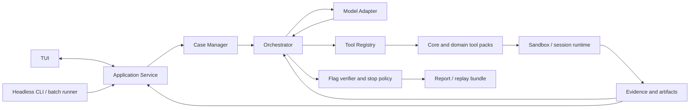

# ctfbot 详细设计与实施计划

日期：2026-09-29  
基线状态：工程脚手架已建立；阶段 A 技术选型和解题功能待完成
上位方案：[AI CTF Agent 设计计划](AI_CTF_AGENT_DESIGN_PLAN.md)
竞品输入：[AI + CTF 竞品调研报告](CTF_AI_COMPETITOR_RESEARCH.md)
当前工程基线：[项目基线记录](PROJECT_BASELINE.md)

## 1. 计划目的

本文件把上位设计中的阶段 A–D 展开为可以拆任务、验收和继续迭代的工程计划。仓库已建立 Python 包结构、版本入口、诊断命令和最小交互菜单；解题循环、provider 与 sandbox 尚未实现。阶段 A 会验证现成框架和执行环境；阶段 B 之后以 ctfbot 自己维护的题目、工具、证据和评测接口为核心，避免将项目长期绑在某一个模型 API 或历史版本的 agent 框架上。

总体路线：

> 先有可复现的题目运行与基线，再交付单 agent 闭环；通过受控消融确认复杂架构是否增益；最后扩大领域覆盖并沉淀经过审查的记忆。

## 2. 产品目标与首版边界

### 2.1 首版目标

- 使用者提供题目描述、附件、flag 格式和可选挑战服务；ctfbot 在每题隔离的工作目录/运行环境中分析题目。
- 一个主 agent 按证据选择工具、写入并运行临时脚本、迭代假设，能与 GDB、nc、REPL 等交互程序保持会话。
- 所有输入、工具调用、失败尝试、输出、提取文件和脚本都有可复查记录。
- 能区分“格式看起来像 flag”“候选 flag”与“通过外部/本地校验的 flag”。
- 每次运行受时间、模型调用、工具调用、CPU、内存、文件容量及网络范围限制。
- 提供可导出的运行报告，包含复现命令和实际证据引用。

### 2.2 首版明确不做

- 不做 CTFd、HTB 等平台账户接入，不自动登录或提交线上比赛答案。
- 不做多人协同 Web 控制台、Discord bot、云端 worker fleet。若以后要做团队工作台，单独立项评估 NUSGreyhats 类方案。
- 不默认载入公开 writeup、已知 flag、历年题解或解题脚本作为 RAG 语料。
- 不默认创建领域专职 agent 或独立临时脚本 agent。
- 不允许模型直接访问宿主机 shell、Docker socket、宿主机凭据或任意公网目标。
- 不把能启动工具容器视为题目已解决；验证等级必须写入结果。

### 2.3 设计默认值

| 项目 | 默认决定 | 决策依据/后续检查 |
|---|---|---|
| 交付形态 | 首版以键盘优先的 TUI 作为主要交互入口；保留 headless 命令用于诊断、报告、评测和自动化 | 解题过程需要持续观察事件、切换证据和交互会话、随时停止或调整；TUI 能直接承载这些操作。底层用稳定的 application service 支持批处理，不在首版扩展 Web UI。 |
| 实现语言 | Python 3.11+ 作为候选基线 | CTF 现成库、exploit、crypto 和 forensics 脚本生态集中；阶段 A 检查依赖、镜像和开发成本后确认。 |
| Agent 架构 | 单主 agent + 工具包动态启用 | 保持跨领域上下文共享；多 agent 需要消融收益才能加入。 |
| 执行模型 | Controller 与每题 sandbox 分离 | Controller 保持凭据和编排；sandbox 执行题目文件、shell 和生成脚本。 |
| 首批题源 | NYU development、CTFTiny 子集和自有/改编授权题 | 公开题仅作开发评测；隐藏或改编题用于估计泛化。题目文件和镜像许可逐项确认。 |
| 运行时底座 | 阶段 A 对 EnIGMA/SWE-agent v0.7.0 做 spike；默认自有薄 runner，执行层可用 SWE-ReX 或简单容器 adapter | 只有现有实现能低成本满足新模型、证据 schema 和隔离要求才考虑 fork。 |
| 数据保存 | 每次 run 一个独立目录；JSON/JSONL + 原始产物文件 | 首版不需要独立数据库；为回归和报告保留稳定格式。 |
| LLM 支持 | 先接一个支持结构化工具调用的 provider；接口先抽象，第二 provider 放到阶段 C/D 验证 | 避免同时调试多个 API。模型、provider 和 agent loop 分离。 |

## 3. 目标架构与模块职责



### 3.1 模块拆分

| 模块 | 责任 | 明确不做的事 |
|---|---|---|
| `tui` | 提供题目导入、运行监看、证据查看、会话交互和报告浏览；通过 application service 读写运行状态并订阅事件。 | 不直接运行命令、不绕过编排/权限检查、不将不可信输出作为终端控制序列发送。 |
| `application` | 提供创建/恢复 run、查询状态、发送控制动作、读取证据和导出报告等用例接口；协调 case manager、orchestrator、runtime 和 evidence。 | 不依赖具体 TUI 框架或 provider SDK；不重复实现业务策略。 |
| `cli` | 提供 TUI 启动器及 doctor、report、bench 等非交互命令；自动化需要时可调用相同 application service。 | 不维护与 TUI 不同的解题状态机或安全策略。 |
| `challenge` / Case Manager | 解析并校验题目清单；复制输入附件；记录 hash；创建 run 目录；校验环境和预算配置。 | 不推断题目答案、不把附件当作可信配置、不直接执行任意附件脚本。 |
| `orchestrator` | 管理 run 状态；构造有限上下文；调用模型；验证并分发工具调用；控制预算、重试、停止和汇总。 | 不自行执行宿主机命令；不把模型声称成功等同于 verified。 |
| `model_adapter` | 将 ctfbot 内部请求映射到某 provider 的消息/工具 schema；归一化文本、tool call、usage、错误和重试信息。 | 不保存 provider key 到题目目录；不执行工具；不隐式改写题目事实。 |
| `tool_registry` | 注册工具定义、输入 schema、能力标签、风险等级、超时和运行约束；按类别/信号加载工具包。 | 不允许工具定义绕过 sandbox policy；分类只用于发现工具，不作为安全授权。 |
| `runtime` | 创建/回收 challenge container；执行命令和脚本；管理持久交互 session；保存进程日志。 | sandbox 内不挂载 Docker socket、provider 凭据或宿主机敏感路径。 |
| `evidence_store` | 保存原始工具输入/输出、结构化事实、实验状态和 artifacts；生成 hash 与引用。 | 不只保存模型摘要；不将模型解释存为未经标记的事实。 |
| `verifier` | 处理 benchmark gold oracle、平台回执、challenge 自带 validator、格式检查和人工确认等级。 | 无 oracle 时不把正则匹配升级为 verified。 |
| `reporter` | 从 run 记录生成 Markdown 报告、复现步骤、工具清单和 solved status。 | 不创造未出现在日志中的命令、结论或证据。 |
| `bench` | 批次运行、结果汇总、固定预算、seed、模型和镜像元数据管理。 | 不在盲测结果出来后用相同 test set 反复调 prompt。 |

建议的 Python 源码边界（模块名可调整，依赖方向保持一致）：

```text
src/ctfbot/
  application/         # solve/resume/report 用例编排
  tui/                 # 交互式终端界面与安全渲染
  cli/                 # TUI 启动器及 headless 命令
  challenge/           # manifest、附件导入、case/run 状态
  agent/               # orchestrator、prompt/context 构造、stop policy
  model_adapters/      # provider API 归一化
  tools/               # registry、core tools、domain packs
  runtime/             # container/session backend 与 policy enforcement
  evidence/            # event log、facts/hypotheses、artifact refs
  verification/        # oracle、challenge validator、verification levels
  reporting/           # report、replay bundle
  benchmark/           # dataset adapter、batch runner、metrics
```

依赖方向建议为 `tui/cli → application → domain modules`; `agent` 通过 `model_adapters` 和 `tools` 的接口工作；`tools` 只能通过 `runtime` 请求执行；`evidence` 是独立接口，不依赖 provider SDK。TUI 与 headless 命令复用同一 application service 和状态机。

### 3.2 运行边界

Controller 管理 LLM provider 凭据和 case 元信息；每题的 challenge sandbox 只接收该题所需文件、工具镜像和显式允许的目标服务。远端 API 调用从 controller 发起。题目文件与生成脚本在隔离工作区执行。

首版默认安全配置：

- 本地附件题不具备公网出网；题目服务使用单独的 per-case network。
- 远端题只有配置允许 host、port、protocol 后才可连接；工具执行时再做范围校验。DNS 解析到的 IP 和重定向后的目标也要复核，防止 scope 绕过。
- 出网范围必须由 sandbox/runtime 层强制执行（例如 per-case network namespace、受控代理或等效防火墙策略），不能只靠 `http.request` 工具校验；否则模型仍可经 `shell.run` 使用 curl/nc 绕过。默认无 egress，允许远端题时只开放 manifest 中的目标及必需协议。
- sandbox 不挂载宿主机 home、SSH/API key、Docker socket 或运行配置；使用非 root 用户和只读 challenge input。
- 普通容器隔离不能自动视作高保证的安全边界。若威胁模型包括恶意二进制、攻击性服务镜像或需要广泛利用的题目，优先使用 rootless 容器或每题 disposable VM；未经过安全评审前，不对宿主机隔离强度作保证。
- 限制 CPU、内存、进程数、磁盘、单命令时长、总 run 时长、并行 session 数和单次输出大小。
- 题目描述、附件和网络响应均视为不可信数据；不能将其中的提示注入当作 system policy。所有工具调用照样过 schema 和 policy 检查。
- API key 从进程环境/秘密存储注入 model adapter；日志和报告中做 secret redaction。
- 若运行时只能通过共享宿主 Docker daemon 启动容器，不向 sandbox 暴露 daemon socket；Controller 对镜像、mount、capability 和 network 配置使用 allowlist。

### 3.3 题目 manifest

推荐 YAML 输入格式；读取后转换并校验为版本化内部 JSON schema。以下字段是设计基线，实际 schema 应加 JSON Schema 文档及错误定位：

```yaml
schema_version: 1
id: example-crypto-01
name: Example Challenge
categories: [crypto, misc]
description: statement.md
attachments:
  - path: files/output.txt
    sha256: auto
flag:
  format: 'flag\{[ -~]+\}'
  verifier:
    kind: format_only  # benchmark_oracle | command | platform_receipt | format_only | manual
environment:
  kind: local          # local | compose | remote
  compose_file: null
  targets: []
policy:
  network: disabled    # disabled | challenge_services | allowlist
  allowlist: []
budget:
  max_turns: null
  max_tool_calls: null
  max_wall_seconds: null
  max_output_chars: null
```

规则：

- 路径必须在 case 输入目录内，拒绝绝对路径、`..` 越界和被跟随后越界的 symlink。
- 附件 hash 由 ctfbot 计算并固定；`auto` 只代表导入时计算，不代表允许每次 run 改变。
- `categories` 为多标签；`unknown` 合法。模型可提交新的候选标签，但必须记录证据和置信度。
- `environment.kind=remote` 必须存在非空 allowlist 和授权确认值；禁止 prompt 自动添加 allowlist。
- `verifier.kind=format_only` 只能返回 `format_valid_candidate`，绝不返回 `verified`。
- Compose 配置需要经过 ctfbot policy 检查；首版拒绝 privileged、host network、Docker socket、宿主机敏感 mount 等不安全字段。
- 基准服务镜像锁定 digest；未知来源的 Compose/build 配置不直接在 Controller 上执行。无法保证环境配置可信时，在 disposable VM 运行。

### 3.4 Run 目录和持久化结构

```text
data/
  challenges/<challenge-id>/
    manifest.yaml
    input/                         # 导入时固定的只读附件
    runs/<run-id>/
      manifest.snapshot.json       # 当次运行使用的完整配置
      state.json                   # 当前状态快照
      events.jsonl                 # append-only 审计轨迹
      model/                       # 不保存密钥；可保存脱敏请求摘要与 usage
      work/                        # agent 可写目录
      scripts/                     # 生成/修改的脚本
      artifacts/                   # 提取文件、转换结果和可交付产物
      sessions/                    # 交互式 session transcript
      reports/
        report.md
```

规范：

- `input/` 原则上不可写；要转换输入时复制到 `work/` 并记录来源 hash。
- 每个 run 是独立隔离目录；resume 同一个 run，retry 创建新 run 并关联 `parent_run_id`。
- JSONL 事件只追加；`state.json` 是可重建的便捷快照，不能替代 event history。
- 原始 stdout/stderr 大文件单独写入 `artifacts/`，事件记录短 excerpt 和 hash。
- 时间使用 UTC ISO 8601；记录 ctfbot 版本、model id、prompt/tool schema 版本、镜像 digest、题目附件 hash 和 budget。

### 3.5 核心数据对象

`state.json` 至少包含：

- `run_status`: `created | preparing | ready | solving | candidate | verified | unsolved | environment_error | error | cancelled`。
- `facts`: `fact_id`、描述、`observation|inference`、来源 evidence refs、置信度、创建时间。
- `hypotheses`: 假设文本、支持/反驳证据、建议区分实验、状态 `untested|active|supported|rejected`。
- `experiments`: 输入假设、计划动作、工具调用 refs、观察结果、结论、是否重复/排除。
- `category_hypotheses`: 多标签、置信度、触发线索、最后更新的事件序号。
- `active_sessions`: session id、工具类型、创建事件、运行状态；真实 PTY/连接句柄由 runtime 管理。
- `flag_candidates`: 候选值可加密或脱敏存储、来源 evidence、校验等级、校验回执。
- `budget_usage`: model turns/tokens/cost、tool calls、wall time、资源峰值（如可获得）。

`events.jsonl` 的通用字段：

```json
{
  "schema_version": 1,
  "seq": 42,
  "timestamp": "2026-09-29T08:00:00Z",
  "event_type": "tool_result",
  "run_id": "...",
  "actor": "agent|orchestrator|runtime|verifier|user",
  "tool_name": "shell.run",
  "input_summary": {},
  "result_summary": {},
  "artifact_refs": [],
  "status": "ok|error|denied|timeout"
}
```

写日志前脱敏 provider secret、authorization header、cookies、challenge 端点凭据等；完整 challenge 附件不复制到事件字段中。

### 3.6 工具接口

工具注册定义至少包含：`name`、`description`、`input_schema`、`pack`、`capabilities`、`risk_level`、`requires_network_scope`、`default_timeout`、`max_output_bytes`、`runtime`。

统一返回对象：

```json
{
  "status": "ok|error|denied|timeout",
  "summary": "简短结论",
  "facts": [],
  "exit_code": 0,
  "duration_ms": 120,
  "stdout_excerpt": "...",
  "stderr_excerpt": "",
  "artifact_refs": [{"path": "artifacts/cmd-42.stdout", "sha256": "..."}],
  "session_id": null,
  "policy_decision": "allowed"
}
```

工具包安排：

| 工具包 | 初版能力 | 延后或可选能力 |
|---|---|---|
| `core` | list/read/stat/hash、文本/字节切片、文件类型、受限 shell、workspace 文件编辑、脚本运行 | unrestricted host shell、后台 daemon、任意下载。 |
| `crypto` | Python 脚本运行；常用编码/哈希/数论库；工具版本和资源限制 | SageMath 重镜像、GPU cracking、外部 FactorDB 查询默认不启用。 |
| `forensics-stego` | file/metadata/strings/archive、图片基本检查、pcap 摘要；工具输出文件化 | 磁盘镜像大规模恢复、在线样本上传。 |
| `reverse-pwn` | ELF/PE 元信息、strings、objdump、checksec；GDB session；pwntools 可用 | 商业反编译器按使用者许可外挂；自动 exploit 库大范围安装后再评估。 |
| `web` | 目标 allowlist 内的 HTTP request、响应对比、有限 browser session | 任意域名爬取、广域扫描、通用漏洞扫描器默认不启用。 |
| `network-misc` | pcap/tshark、基本协议解析、有限 socket session | 任意网段扫描和非挑战目标访问。 |

优先使用已有 CLI 工具并做好 schema/结果归一化；重复、高风险、参数易错或输出巨大时才写工具 wrapper。模型仍能通过 `shell.run` 在容器内组合命令。类别只控制发现/载入，不控制网络授权。

### 3.7 解题循环与结束状态

1. **Intake**：验证 manifest、路径和 hash，检查许可/授权字段，初始化 run。
2. **Prepare**：构造 runtime；启动 challenge service（若配置）；记录镜像/服务健康状态。环境未就绪时不能调用解题模型。
3. **Triage**：确定性检查文件类型、目录、服务、可用工具；得到类别候选和事实，不做昂贵扫描。
4. **Reason**：主 agent 阅读短摘要与相关 artifacts，维护最多若干活跃假设，并优先挑选能区分假设的高信息量实验。
5. **Act**：模型提出 tool call；orchestrator 验证 schema、预算、scope、路径和副作用，再交给 runtime 执行。
6. **Observe**：返回短摘要和 refs；原始日志/新产物落盘；facts/hypotheses/experiments 更新。
7. **Verify**：提取 flag 候选后调用对应 verifier；保存 `candidate / verified / rejected / unverified` 状态。
8. **Stop**：达到 verified、预算耗尽、用户取消、环境不可用或连续无进展阈值时停止；输出结论、未解决点和下一步建议。

无进展检测由确定性规则辅助：相同工具名与归一化参数重复调用且中间没有新增证据时，第一次提示避免重复，第二次要求模型改变假设或说明重试理由；达到配置的无进展窗口（建议初值为 3 次低信息量实验）后停止或要求人工指导。不得仅因输出文本相似就判定重复，避免阻止有意重复的 oracle 采样。

模型无需每轮重复输出全量计划；每轮至少携带当前目标、活跃假设、最新关键证据、工具可用性、剩余预算和下一步约束。超过上下文阈值时按结构摘要旧轨迹，但保留 event refs 和原始数据。

## 4. 阶段路线总览

| 阶段 | 目标 | 主要交付物 | 通过条件 |
|---|---|---|---|
| A：环境与基线 | 确定运行范围、题目格式、底座选择和可复现基线 | 兼容性 spike、数据/环境方案、基线轨迹与决策记录 | 选定题集可复现启动；能验证或准确标注验证等级；完成底座选择记录。 |
| B：单 agent MVP | 实现工具驱动、可记录、可停止和可导出的端到端循环 | TUI、manifest、sandbox、provider adapter、core/领域工具、state/evidence、report | 多类别小题能运行完整循环；无越权工具调用；轨迹和候选 flag 状态准确。 |
| C：受控消融 | 判断工具包装、session、RAG、多 agent 是否值得其成本 | 固定基线实验、分类结果、成本和决策记录 | 每项架构增量有对照数据；进入下一阶段的复杂性都有明确依据。 |
| D：扩展与记忆 | 扩领域、加隐藏/改编评测、形成可信知识沉淀 | 领域包、隐藏测试集、经审核记忆、批次评估 | 六类基础工作流可运行；泛化、记忆污染、成本和安全性按项报告。 |

阶段按 exit gate 逐步推进，不以日历日期代替验收。每个阶段可拆成独立迭代；阶段 A 的选择会影响 B 的底座实现，但不得改变题目/轨迹的 ctfbot schema。

## 5. 阶段 A：环境与基线

### 5.1 目标

在建立工具目录或多 agent 前，确认 challenge runtime 可复现、模型可调用、flag 验证可用，并用 EnIGMA 候选和最小单 agent loop 做成本/兼容性比较。

### 5.2 工作包

| ID | 工作内容 | 输出 | 验收方式 |
|---|---|---|---|
| A1 范围确认 | 首版只支持授权练习/benchmark；定义 local files、本地 compose 服务、远端 allowlist 三种模式，首版禁用未声明远端访问。 | scope 文档和 threat boundary | 每类模式有允许/禁止动作、授权输入和失败状态说明。 |
| A2 底座 spike | 固定版本跑 EnIGMA/SWE-agent v0.7.0；记录 provider、Docker、IAT、扩展工具、结果导出的适配情况。并行准备极简 direct-tool loop 作参照。 | spike notes、依赖清单、改造面 | 可复现安装/启动；记录 blocker 和适配工时。不为通过 spike 直接修改上游项目核心。 |
| A3 sandbox spike | 检查本地容器/候选 SWE-ReX 的启动、session、文件映射、网络隔离和清理；选一种本地默认 backend。 | runtime ADR（架构决策记录） | 恶意/异常路径、host mount、任意目标等负面场景被拒绝；容器结束后资源和 session 清理。 |
| A4 数据集准备 | 选 10–20 道 development 题，至少覆盖 4 类；确认题目可取得、镜像可用、启动步骤稳定、gold verifier 或验证等级明确；记录公开/私有和来源许可。 | pilot set manifest + 环境检查表 | 每个 challenge 固定附件/镜像 hash、启动与关闭方法、目标、expected verifier。 |
| A5 基线协议 | 固定 model/provider/version、最大 turns、wall time、工具调用和容器资源；定义日志字段及 `candidate/verified` 结果。 | baseline protocol | 同一配置能重复运行，运行元数据完整；格式命中不能被标为 verified。 |
| A6 基线执行 | 对 pilot set 运行最低可用 agent；优先记录失败原因和人工介入，不做 prompt tuning。对确定性可复现子集做重复 run。 | 原始 trajectory、汇总表、失败分类 | 结果可追踪到 event 和 challenge version；异常环境与 agent 解题失败分开记录。 |
| A7 选型决策 | 结合适配成本选择“自有薄 runner”为主（默认）或 fork EnIGMA；确定 model adapter 和 runtime adapter 边界。 | ADR-001：runner；ADR-002：sandbox；ADR-003：provider | 有单一可执行决定、退出条件和锁定版本；未通过条件时不在 EnIGMA 上深度开发。 |
| A8 TUI 可行性 | 用 fake provider/event stream 验证候选终端 UI 技术；检查异步更新、终端尺寸变化、键盘焦点、长输出分页、交互 session 和无颜色模式。 | ADR-008：TUI 技术与渲染约定 | 模型/工具运行期间界面仍可响应；可查看假事件流；resize 与错误状态可理解；不可信输出按纯文本安全渲染。 |

### 5.3 阶段 A exit gate

- Pilot 题集可重复初始化、启动/停止；无法启动的题有独立 environment error，不混入 solve failure。
- 至少一个 provider 的 tool call 能端到端运行，并保存模型用量和完整 event trail。
- Flag verifier 能区分 benchmark oracle、challenge success signal、format-only 和人工确认等级。
- sandbox 资源、文件和网络边界有可执行配置，工具层默认拒绝未授权访问。
- 形成 EnIGMA 适配决策；若保留 EnIGMA，记录需维护的 fork patch 和上游兼容策略。
- TUI 技术 spike 能显示并更新运行事件；确认核心 application service 不依赖 UI 框架。

## 6. 阶段 B：单 agent 解题 MVP

### 6.1 目标

实现从 TUI 导入题目、查看授权范围、启动/监看运行、交互操作、检查证据到校验和导出报告的单题闭环。headless 命令复用同一 application service，供诊断、评测与自动化使用。该阶段不引入常驻领域专家 agent、跨题 writeup RAG 或 Web UI。

### 6.2 TUI 交互与命令入口

主要交互由 TUI 承载。启动方式建议为：

```text
ctfbot                                  # 打开 TUI 首页
ctfbot <challenge-dir>                  # 打开 TUI 并导入/预览指定题目
ctfbot doctor                           # 检查容器、工具和模型配置，不解题
ctfbot report <run-id> --out <path>     # headless 导出报告
ctfbot bench run <suite>                # headless 批量评测
ctfbot solve <challenge-dir> --headless # 可选的自动化入口，共用解题服务
```

TUI 的核心页面与交互：

1. **首页/运行列表**：展示题目、类别、最近运行、运行状态、候选/已验证结果和预算；支持新建、打开和恢复。
2. **题目导入与授权预览**：展示描述、附件及 hash、flag 校验方式、环境和 host/port 范围；附件路径或网络范围异常时阻止启动。远端题在启动前需要明确确认。
3. **运行工作区**：事件时间线展示模型动作摘要、工具调用、结果与证据引用；状态栏显示活跃假设、预算、当前阶段和 verified/candidate 状态。可以继续指导、暂停/继续或停止运行。
4. **证据与产物查看**：浏览文件树、分页文本/十六进制摘要和 artifacts；每条结论可追溯到原始事件及输入输出。
5. **交互会话面板**：为 GDB、nc、REPL 提供明确的会话焦点、输入区、输出区和结束操作；会话内容写入 transcript 并应用相同的时限和 scope policy。
6. **结果与报告视图**：显示验证等级、未解决路线、复现信息和导出位置；candidate 不得在界面上伪装成 verified。

界面以键盘操作为主，鼠标为可选增强；长任务异步运行，界面可继续响应停止/查看等操作。终端 resize、窄终端、分页、无颜色模式、帮助/快捷键和可读错误都纳入 MVP。具体按键由 A8 spike 确认，避免计划提前绑定某个 TUI 框架。
首版不支持离开 TUI 后在后台继续解题。用户退出时先确认停止当前 run；停止会终止模型循环和其 sessions/container，但保留已落盘证据，之后可从 TUI 恢复。这样首版不需要常驻 supervisor 或 IPC；若后续确有后台运行需求，再单独评估。

渲染边界：题目附件、工具 stdout/stderr 和远程服务响应均是不可信文本。界面必须转义/过滤 ANSI、OSC 和其他终端控制序列，避免清屏、伪造提示或改写剪贴板；原始输出仍保存为证据，只有安全的文本视图送入 TUI。交互 session 通过受控输入/输出面板工作，不把不可信字节直接透传到宿主终端。

运行状态和 event log 持久化；正常退出及可捕获的异常退出时清理子进程/container。TUI 下次启动时检查未结束 run 与带 ctfbot 标记的遗留资源，记录清理结果并将 run 标记为 `interrupted`，允许用户查看原因后恢复。显式停止应终止 agent 和其 sessions/container。所有入口默认不覆盖已有 run；网络题在 TUI 中展示 manifest allowlist 并要求显式授权；`doctor` 和报告不得泄漏密钥。

### 6.3 工作包

| ID | 工作内容 | 主要设计要求 | 验收输出 |
|---|---|---|---|
| B1 schema/TUI shell | 实现 manifest schema、路径验证、输入 hash、TUI 首页和题目导入/预览。 | 错误必须指出文件、字段和原因；未知字段可按版本策略拒绝或保留，不能静默丢弃安全字段。 | 能在 TUI 导入普通文本、压缩包、二进制和目录附件；预览信息完整，路径越界被拒绝。 |
| B2 case manager | 创建 immutable input、run snapshot、parent run 关联和可恢复状态。 | retry 与 resume 不混淆；每次 run 固定 model/prompt/tool/environment version。 | 多个 run 不互相覆盖 artifacts；resume 后 event seq 连续。 |
| B3 sandbox runtime | 容器镜像、workspace mount、受限执行、资源限制、网络策略、清理和诊断。 | challenge input read-only；work writable；无 secret/Docker socket；超时和取消强制终止子进程。 | 超时/取消后 container、PTY/session 均有清理结果；不可信容器错误不会写入 controller。 |
| B4 model adapter | 统一内部 tool-call 请求与响应；首发一个 provider；provider key 在 controller 使用。 | 支持 usage/cost、模型错误、rate limit、tool call malformed、最大回复长度；重试只用于可重试错误。 | 相同内部 prompt/tool schema 能切换模型配置而不改 orchestrator。 |
| B5 orchestrator/state | 实现 triage→假设→实验→反馈→验证 loop；预算计数和 stop reason。 | 每个模型 tool call 经 schema/policy/budget 三重检查；失败记录为事实来源而非丢弃。 | 用 fake provider 可复放完整状态机；预算达到后无额外模型/tool调用。 |
| B6 core tools | 文件列表/查看/切片/hash、文件类型、受限命令、workspace 编辑、脚本执行。 | 禁止路径逃逸；命令 cwd 固定于 sandbox；stdout/stderr 分开；长输出写 artifact 并返回摘要与分页引用。 | 选定题目中可完成常见 triage、python/sage-lite 脚本和 artifact 读取。 |
| B7 交互式 sessions | GDB、nc 或 Python REPL 的通用 session 生命周期接口。 | `session_id` 不可跨 run；输入/输出 size、idle timeout 和总 runtime 可配置；退出/崩溃可检测。 | 可开始、发输入、读输出、继续使用、结束并复查 transcript。 |
| B8 初始工具包 | 实现 general、crypto、forensics/stego、reverse-pwn、web 的最少命令能力；按 tool availability 探测，不保证每种题都可自动解。 | 常用工作流薄封装；shell 仍是 escape hatch；工具缺失返回 actionable error 和可用替代。 | pilot 至少 4 个类别完成实际 tool-use trajectory；工具缺失不会伪报成功。 |
| B9 evidence/report | 追加 event log、artifact hash、facts/hypotheses/experiments、Markdown report 和 replay 命令。 | 报告只引用日志中真实动作；输入的秘密和 provider key 脱敏；写出题目公开性信息。 | 随机抽取报告步骤都能指向 event/artifact；无证据结论标记为 model inference。 |
| B10 verification | 支持 benchmark exact oracle、显式 command verifier、平台 receipt（后续）、format-only 和人工确认。 | verifier 独立于生成答案的 agent；candidate 与 verified 状态不可混淆；匹配多个 flag 要保留多个候选。 | 无 oracle 的 challenge 不出现错误的 verified 状态；gold mismatch 被记录。 |
| B11 配置与可观测性 | 设置 run budget、容器资源、工具超时、允许目标、日志级别和模型参数；提供阶段耗时及费用统计。 | 配置按 defaults → user → challenge policy 合并，安全限制只可收紧不可放宽；隐私信息不进普通日志。 | 每个 run 可查剩余预算、工具次数、token/cost（provider 提供时）和 stop reason。 |
| B12 TUI 运行工作区 | 实现事件时间线、状态/预算视图、暂停/继续/停止/指导操作、证据跳转和报告入口；TUI 通过 application service 订阅状态。 | 长任务不能阻塞界面；界面状态从持久化事件/状态派生；操作反馈明确且可审计。 | fake provider 与真实 provider 下都能边运行边查看事件、预算和证据，并正确发送控制动作。 |
| B13 安全渲染与可访问性 | 实现不可信文本安全渲染、长输出分页、窄屏/resize、无颜色和快捷键帮助。 | 不向宿主终端写入附件或工具返回的原始控制序列；颜色不能是唯一状态编码。 | ANSI/OSC 样本只显示为安全文本；resize、窄屏与无颜色下关键状态仍可辨识。 |

### 6.4 单 agent 提示与策略约定

system/developer policy 与 challenge 内容分区；题目描述和文件内容作为 untrusted data。Agent loop 每轮要求模型：

1. 根据工具结果声明新事实或保留不确定性，不把推断写成观察。
2. 选择一项主要假设和最能区分它的实验；必要时先读取 evidence 原文。
3. 只调用已注册工具，使用相对路径和明确目标；不能通过描述文本修改 network allowlist。
4. 得到 flag 后解释来源并调用 verifier；没有 oracle 时明确报告未验证。
5. 卡住时返回进展、排除路线、仍需的外部条件，而非无限重复命令。

允许最多 3–5 个活跃假设（默认可配置）以控制上下文。此数字是控制状态规模的起始默认值，不是 CTF 解题硬限制；若评测发现截断复杂策略，可调整并记录版本。

### 6.5 阶段 B 验收与交付

- TUI 能完成题目导入/预览 → 授权确认 → 启动 → 实时监看/指导 → 停止或恢复 → 查看证据 → 导出报告的基本生命周期。
- `doctor`、`report` 和 `bench run` 可在无 TUI 环境中运行；headless solve（如实现）与 TUI 共用同一 application service 和安全策略。
- 端到端 pilot 至少覆盖 4 类，按类别报告 verified、candidate、unsolved、environment error。
- 命令、脚本、交互 session 均经过相同的 sandbox/预算控制；不允许一个工具绕过 policy。
- 对失败、超时、无模型凭据、Docker 不可用、工具缺失和模型乱传参数均有可读错误与正确状态。
- 生成的 report 和 artifacts 可用于人工复盘和复现；关键事件不可仅存在于模型上下文。
- 任何 verified flag 都附 verifier 类型和回执；format-only 不会标记为 solved/verified。

交付物：可运行 TUI、headless 诊断/报告/评测命令、v1 manifest schema、内置 sandbox adapter、一个 LLM provider adapter、core + 初始 domain packs、trajectory schema、pilot benchmark 报告和使用/安全说明。

## 7. 阶段 C：受控评估与消融

### 7.1 目标

用可复现、同条件对照判断哪些组件真的提升 solve rate、成本或稳定性。架构增量采用逐项消融；不要一次同时改变模型、工具、prompt 和环境。

### 7.2 实验设计

**实验集**：

- 主要快速回归集：CTFTiny 子集或经过清理的 NYU development 子集。
- Pilot 对照集：阶段 A 固定 10–20 题，至少 4 类；冻结后不再作为 prompt 调优集。
- 泛化审计：另外留出改编题/私有题，不将答案导入检索索引或 prompt 示例。
- 同题多次运行：对随机性较强或架构关键题做 3 次以上重复；其余可先一次全量加抽样复测，减少 API 成本。

**控制变量**：同一题目附件与 hash、容器镜像 digest、模型版本/参数、时间与 token/tool-call 预算、联网策略、flag verifier、重复次数。模型 provider 不可避免不同时，作为独立实验组，不把结果混在一起。

### 7.3 消融矩阵

| 比较项 | 对照组 | 实验组 | 主要问题 |
|---|---|---|---|
| 工具包装 | 受限 shell + 原始输出 | 常见 workflow 薄 wrapper + raw artifact pointer | wrapper 是否降低误用并提高成功率，还是限制探索？ |
| 交互会话 | 一次性 command | 持久 GDB/nc/REPL session | 会话对 pwn/rev/web 题的成功率、成本和复现性贡献多大？ |
| 输出反馈 | 固定截断全文 | 结构摘要 + 可寻址原始输出 | 是否减少上下文消耗，同时不损失关键证据？ |
| 领域路由 | 全部 core tools 常驻 | 多标签 triage + 按需 pack | tool definition 数量减少时，是否保持发现跨领域线索能力？ |
| 领域 agent | 单 agent + playbook | 某类独立 specialist/subagent | 是否在固定总预算中获得收益，是否产生重复命令和结论冲突？ |
| RAG | 无检索/仅技术操作手册 | 有来源标签的检索 | 技术知识检索是否提高泛化；是否因题解泄漏虚高？ |
| 记忆 | 仅当前 run state | 加入经过审核的跨题经验 | 记忆是否降低重复失败并提高新题效果？ |

### 7.4 指标

主要指标：

- verified solve rate：只计算通过明确 oracle 或 challenge success signal 的题。
- candidate rate 与 format-only rate：单独报告，不与 verified 合并。
- category accuracy/solve rate：题型分类命中率及每个类别成功率。
- cost per verified solve：model cost、token、工具运行资源分开统计。
- solve latency、模型 turns、tool calls、失败后重复动作率。
- trajectory reproducibility：冻住环境和脚本后能重放到关键验证点的比例。
- human intervention 和 environment failure：分别计数。
- 安全事件：policy deny、越权尝试、目标解析不匹配、意外公网请求，要求逐条审计。

统计输出包含分子/分母，不只给百分比；报告重复运行 mean/range；同一 challenge run ID 能和原始 trajectory 对齐。

### 7.5 阶段 C 决策规则

- 只有在固定预算下改善 verified solves 或明显减少成本/时间/重复动作，并且没有降低安全性、复现性或类别覆盖，才保留新组件。
- 多 agent 的额外 token/费用、并行容器和共享状态维护成本必须计入比较；“多个 agent 各自解题更快”不代表同总预算更高效。
- RAG 默认只对带来源的技术手册开放；题解库只能作为单独模式，用于真实练习或 hint 功能，不进入盲测评测条件。
- 每项实验形成 ADR：支持/否决结论、依据、已知限制、是否回滚。无明确收益的复杂性不进入阶段 D 默认配置。

交付物：冻结的 pilot/eval manifests、runner batch mode、评测方案、消融结果、成本报告和架构决策记录。

## 8. 阶段 D：领域扩展与受控记忆

### 8.1 目标

从可运行 MVP 扩展到覆盖六类常见 CTF 的工具包，并引入经过来源、许可和答案泄漏审查的知识。评估重点由“有工具”转向“新题泛化、领域均衡、成本可控”。

### 8.2 领域工具包交付规范

每个 domain pack 必须包含：

- `pack.yaml`：pack 名称、适用标签、触发线索、所需二进制/库、网络需求、风险等级、版本。
- `README.md` 或 playbook：初始检查、假设提示、常见反例、失败后的下一步和验证方式；禁止内嵌特定题目 flag。
- 工具 schema 及输入/输出说明；底层命令、超时、输出文件和缺失依赖的处理。
- smoke/fixture 方案：本地小样本覆盖输出解析和产物 hash，不依赖公网比赛服务。
- 题目覆盖矩阵：该 pack 在哪些题型可用、已知盲点、测试集版本和成功/失败案例。
- license/source inventory：二进制、数据库、语料、脚本的来源和许可证；商业软件按用户自有授权接入。

### 8.3 领域推进顺序

| 顺序 | 领域 | 目标能力 | 特别风险/决策 |
|---|---|---|---|
| D1 | Crypto + misc | Python 脚本、编码/哈希/常见 RSA/椭圆曲线线索；手工实验可记录和复跑。 | SageMath 镜像较大；在线分解服务默认关闭。模型枚举操作必须有限额。 |
| D2 | Forensics + stego + network | 元数据、归档、图片/音频/流量 triage；提取文件按来源 lineage 链接。 | 大文件和复杂文件解析器属于攻击面；限制容量、时间，不默认上传外部服务。 |
| D3 | Reverse + pwn | ELF/PE triage、反汇编/调试、pwntools、session 生命周期和 exploit replay。 | 挑战二进制不可信；生成的 exploit 限于本地题目服务或显式 allowlist。 |
| D4 | Web | HTTP/browser 基本交互、差异观察和响应证据保存；目标在 allowlist 内。 | 严格防 SSRF/重定向/DNS rebinding 及请求跨到宿主或内网。自动扫描器单独审批工具能力范围。 |
| D5 | 混合题/未知类 | 多标签变更、跨 pack 组合、低置信度时回退 core tools。 | 不以分类准确代替解题表现；记录重分类导致的 pack 变化和成功率。 |

### 8.4 经验库与 RAG 分层

按资料属性维护独立 namespace，并在 run 配置中显式指定允许读取的 namespace：

1. **操作手册库**：通用协议、算法、工具命令和调试步骤；允许盲测，但记录文档版本和引用。
2. **失败模式库**：不含题目答案的工具误用、环境错误、无效路径和复现建议；只有经过审核后能跨题复用。
3. **题目经验库**：特定 challenge 的历史 notes/solve 脚本；默认仅同题 resume 或用户明确的练习模式启用，不能用于盲测泛化分数。
4. **公开 writeup/答案库**：单独数据域、默认禁用；仅用于可解释的“有参考资料辅助”模式。评测报告必须说明是否启用。

记忆写入流程：候选条目 → 对照证据与源文件 → 检查是否包含 flag/题目专属常量/直接 exploit → reviewer 批准或拒绝 → 写入版本库 → 以新题验证没有引入过拟合。任何条目都保留来源 URL、抓取/导入日期、许可证、hash、适用标签和清理状态。

### 8.5 多 agent / 高级能力的准入

- Planner/executor：只在阶段 C 表现显示长流程全局计划是瓶颈后启用；共用结构化 case state，不复制整份历史聊天。
- Specialist agent：接收一个独立可验证分析子任务，并返回结论和 evidence refs；不能独立改变 flag status、授权范围或全局 run state。
- Race mode：只对模型/策略对比或难题救援启用，给每条 run 独立 workspace 和预算；第一个通过 oracle 后停止其他 run。
- Script worker：只有脚本实现和主解题可以并行、且阶段 C 对照显示节省预算时才启用；worker 的网络策略与主 run 相同或更严格。
- Human hint/advisor：独立模式，不修改盲测输入；advisor 读取 transcript 时不直接拥有执行工具，relay 的提示写入审计轨迹。

### 8.6 阶段 D 交付与验收

- 六个大类至少都有可发现的基础 tool pack；每个 pack 有环境检查、操作手册、版本、来源和 smoke fixtures。
- 建立与公开 benchmark 分离的隐藏/改编集；每类尽量有多种解题机制，不由单一题型代表整类能力。
- 发布报告区分公开题、改编题、私有题以及是否可被历史模型训练/语料覆盖；不以公开集成绩推断全新题泛化。
- 已纳入的跨题 memory 有 provenance、license、答案污染分级和失效处理机制。
- 任何 specialist、RAG、tool wrapper、race 或高级工具都说明阶段 C 的增益证据和额外成本。

## 9. 工程质量计划

### 9.1 验证层次

- **schema checks**：manifest、tool inputs、events、state migration 和 report 输入验证。
- **unit checks**：路径安全、预算扣减、flag verification level、工具输出截断和脱敏。
- **runtime checks**：fake provider + disposable sandbox 验证 run 生命周期、取消、恢复、网络拒绝和 session 清理。
- **pack fixtures**：每个工具包使用本地 fixture 校验解析器、hash 和 artifact 引用。
- **benchmark runs**：逐题运行并记录模型/API 与镜像元数据；抽样人工复核轨迹。
- **security review**：恶意文件、路径 traversal、命令超时、host mount、DNS/redirect scope 绕过、日志泄密和取消残留。

这些是后续实现阶段的计划任务；本次文档生成没有运行任何测试或题目。

### 9.2 版本与兼容性

- manifest、event、tool output、prompt 和 pack schema 均有版本号。
- 每次 run 固定代码版本、model ID、provider 参数、tool pack 版本、runtime image digest、challenge hash 和 verifier 版本。
- state migration 只支持明确的旧 schema；无法安全转换时要求新 run，不静默重写历史证据。
- 对模型 provider 的错误、rate limit、tool-call JSON 变化做 adapter contract checks；provider 升级不得改变 evidence schema。
- Benchmark 出现镜像修订时以新 dataset version 记录，不覆盖旧结果。

### 9.3 发布验收指标

发布前必须生成以下表格/报告：

- 每类 verified / candidate / unsolved / environment-error 计数和分母。
- Exact verifier 类型、false positive 数、flag candidate 误判数。
- 每题平均与分位数：tokens、费用、时长、tool calls、重复操作率。
- 轨迹完整性和固定环境复现率。
- 人工介入点和未解决外部依赖。
- 沙箱越界、非 allowlisted 连接和 secret 泄漏：目标为零；任何命中均阻断发布。
- 题目公开状态、writeup/RAG 可用性、题目/镜像 license 和 benchmark contamination 说明。

不预先规定 solve-rate 数字：阶段 A 先建立基线，阶段 C 再由项目目标设定相对基线的最小有用增益，避免无数据时凭空设门槛。

## 10. 主要风险、缓解与触发条件

| 风险 | 影响 | 缓解措施 | 触发时的动作 |
|---|---|---|---|
| EnIGMA 旧版本适配成本过高 | fork 消耗主开发资源 | 阶段 A spike 限定范围；稳定 manifest/tool/evidence 契约独立于 EnIGMA。 | 若 provider、runtime 或 state schema 修改涉及大量核心补丁，转自有薄 runner。 |
| 题目 Docker 环境损坏或不一致 | 误把环境故障归因模型 | 启动 health check、镜像 digest、environment error 分类和重试上限。 | 环境错误题不参与 solve-rate 分母，维护环境修复记录。 |
| 公共题答案被模型记忆 | benchmark 成绩虚高 | development/test 分开；隐藏/改编题；trajectory/provenance；答案 RAG 分区。 | 若怀疑污染，标记该题结果为 contaminated/uncertain，不计入泛化结论。 |
| 生成脚本或题目文件逃逸 sandbox | 主机、网络或凭据受影响 | 隔离执行、资源限制、路径验证、默认断网、秘密不进 sandbox。 | 任何越界事件立即停用该 tool/backend，保留日志并完成复核。 |
| Agent 产生错误 flag 并报告成功 | 比赛提交错误或报告不可信 | verifier 独立执行；多候选记录；无 oracle 降级为 unverified。 | false positive 作为阻断问题修正，再跑回归集。 |
| 过早做多 agent、RAG 或过度打磨 TUI | 进度和成本失控 | 阶段 C 的准入 gate；首版 TUI 只覆盖解题必要视图；对照相同预算。 | 未测到净收益的组件不并入默认 MVP；高级布局与主题延后。 |
| 工具 schema 太多导致模型选错 | token 浪费、工具滥用 | pack 懒加载、短 descriptions、能力/副作用字段和工具 discover/list。 | 以工具选择错误/重复操作数据调整 schema 或 pack granularity。 |
| 知识库污染、版权或来源不明 | 评测无效、分发风险 | provenance/许可证审核、答案库隔离、清理和删除记录。 | 来源不明或许可不清的语料不进入默认发布包。 |

## 11. 拆分为工程 Epic

| Epic | 对应阶段 | 主要依赖 | 可独立评审的交付 |
|---|---|---|---|
| E1 Runtime feasibility & baseline | A | Docker/运行节点、challenge 样本、模型凭据 | EnIGMA spike、sandbox adapter 选择、pilot baseline。 |
| E2 Challenge schema & TUI | A–B | E1 的题目与环境决定 | manifest schema、TUI 导入/运行列表骨架、doctor/report/headless bench 命令。 |
| E3 Runtime isolation & sessions | A–B | E1 runtime 决策 | local container backend、命令运行、interactive session 生命周期和审计。 |
| E4 Model adapter & orchestrator | B | E2 schema、E3 tool execution | fake provider contract、一个真实 provider、budgeted solve loop。 |
| E5 Evidence, verifier, report | B | E2 state/events、E4 loop | append-only trace、candidate/verified status、Markdown report/replay。 |
| E6 Core/domain packs | B–D | E3 runtime、E4 registry | core + crypto/forensics/rev-pwn/web packs 与 fixture。 |
| E7 Evaluation & ablations | A、C–D | E1 dataset、E4/E5 metrics | batch runner、baseline/ablation tables、ADR decisions。 |
| E8 Memory & advanced orchestration | D only | E7 positive evidence、knowledge governance | reviewed memory service、可选 specialist/race/script worker。 |
| E9 Product surface beyond TUI | 后续单独立项 | 稳定的 application service、使用场景确定 | Web UI、platform connectors、team workflow；继续复用 TUI 使用的业务服务。 |

## 12. 需要持续维护的决策记录

每个架构决策文件至少记录：问题、备选方案、实验依据、成本、风险、决定、回滚条件和日期。初始 ADR：

1. **ADR-001：EnIGMA fork 与自有薄 runner 的边界。** 阶段 A 做决定；默认不把业务 schema 和 evidence 存储放入 EnIGMA 私有内部格式。
2. **ADR-002：容器/session backend。** 比较 Docker CLI、自有 container adapter 和 SWE-ReX；安全边界与 cleanup 比并行吞吐优先。
3. **ADR-003：模型/provider。** 选择一项 tool-call 能力稳定的 provider 作首版，并明确 cost/usage 计量方法；接口避免绑定具体 SDK。
4. **ADR-004：flag verification levels。** 定义 oracle、service signal、format-only、manual 的状态迁移和对外措辞。
5. **ADR-005：首批挑战来源及 license。** 记录数据集版本、镜像源、挑战文件及 writeup 的可用范围。
6. **ADR-006：工具 pack 加载规则。** 分类低置信度和混合题的默认 core tool 行为；工具发现和授权分离。
7. **ADR-007：RAG/记忆隔离。** 确定哪些 namespace 可进 blind evaluation，以及如何审查跨题条目。
8. **ADR-008：TUI 技术与渲染约定。** 阶段 A 比较异步事件更新、session 输入、resize、窄屏、无颜色、分页和不可信文本处理；UI 框架只通过呈现层接入。

## 13. 阶段完成后的预期状态

- **阶段 A 后**：知道怎样稳定运行题目、如何验证结果以及 fork 是否划算；有可信的小基线，但不声称高成功率。
- **阶段 B 后**：有一个模型可接入、单 agent 可迭代、可留证据、可停止和可复现的 TUI MVP；覆盖范围有限但状态和数据契约稳定，诊断和批量评测可 headless 运行。
- **阶段 C 后**：有数据说明包装工具、IAT、memory、specialist 是否带来净收益；保留或移除组件有依据。
- **阶段 D 后**：具备覆盖六大类的基础工具包、受污染控制的泛化评测和来源透明的经验库；是否发展成团队工作台由后续产品需求决定。

## 附录 A：首版完成定义（Definition of Done）

一项功能只有同时满足以下条件才算完成：

1. 输入/输出 schema 和失败状态有文档。
2. 对工具输入进行类型、路径、预算和权限验证。
3. 原始结果有证据引用，敏感信息经过脱敏。
4. 有本地 fixture 或 fake-provider 验证方案；工具升级可以回归。
5. 失败、超时、取消和部分产物都有明确清理与状态迁移。
6. 使用者能从 `ctfbot doctor`、日志或报告看到可行动的诊断信息。
7. 代码、镜像和数据来源通过 license/provenance 检查。

## 附录 B：实施顺序建议

1. 先建立 manifest、evidence schema 和 sandbox ADR 的短设计评审；并行准备 pilot challenge list。
2. 完成阶段 A 的环境和 baseline spike，冻结版本与预算后才实现完整工具目录。
3. 阶段 B 先做 fake provider + core file/shell + event store 的短闭环，再接真实模型；降低模型调试和 schema/debugging 混淆。
4. 再加入 session、flag verification、报告和首批 pack；每个能力都通过本地 fixture 检查。
5. 阶段 C 先比较常用工具 wrapper 与原始 shell，再投入 specialist/RAG 等高成本架构。
6. 阶段 D 按 domain pack 规范扩展；每加入语料或专用 agent，都在公开与隐藏题集分别评估。
7. Web UI、平台连接器、并行云 worker 作为单独产品阶段，复用稳定的 application service；TUI 和 headless 命令仍调用同一用例接口。
